# RetainIQ — Plateforme IA de Prédiction & Rétention du Churn

> **Projet Industriel 2024-2025**  
> Stack : Python · Streamlit · XGBoost · SHAP · SQLite · APScheduler · SendGrid · Brevo · Gemini AI

---

## Table des matières

- [1. Vue d'ensemble du projet](#1-vue-densemble-du-projet)
- [2. Architecture générale](#2-architecture-générale)
- [3. Workflow complet — de l'import CSV à la prédiction finale](#3-workflow-complet--de-limport-csv-à-la-prédiction-finale)
  - [Étape 1 — Authentification](#étape-1--authentification)
  - [Étape 2 — Import du fichier CSV](#étape-2--import-du-fichier-csv)
  - [Étape 3 — Détection automatique des colonnes](#étape-3--détection-automatique-des-colonnes)
  - [Étape 4 — Nettoyage automatique des données](#étape-4--nettoyage-automatique-des-données)
  - [Étape 5 — Rapport de qualité](#étape-5--rapport-de-qualité)
  - [Étape 6 — Entraînement du modèle XGBoost](#étape-6--entraînement-du-modèle-xgboost)
  - [Étape 7 — Prédictions et enrichissement du DataFrame](#étape-7--prédictions-et-enrichissement-du-dataframe)
  - [Étape 8 — Exploitation dans le dashboard](#étape-8--exploitation-dans-le-dashboard)
- [4. Guide d'installation](#4-guide-dinstallation)
  - [4.1 Prérequis](#41-prérequis)
  - [4.2 Installation pas-à-pas](#42-installation-pas-à-pas)
  - [4.3 Configuration des variables d'environnement](#43-configuration-des-variables-denvironnement)
  - [4.4 Lancement de l'application](#44-lancement-de-lapplication)
  - [4.5 Comptes de démonstration](#45-comptes-de-démonstration)
  - [4.6 Commandes utilitaires](#46-commandes-utilitaires)

---

## 1. Vue d'ensemble du projet

### Qu'est-ce que RetainIQ ?

**RetainIQ** est une plateforme web B2B d'intelligence artificielle dédiée à la **prédiction et à la rétention du churn client**. Elle permet à des entreprises de cinq secteurs d'activité différents de transformer leurs données clients brutes en décisions de rétention concrètes et automatisées, sans compétences techniques préalables.

La plateforme couvre l'intégralité de la chaîne de valeur de la rétention :

```
DÉTECTER → COMPRENDRE → SIMULER → ALERTER → AGIR → AUTOMATISER
```

| Capacité | Ce que RetainIQ fait concrètement |
|---|---|
| **Détecter** | Prédit la probabilité de départ de chaque client (score 0–100%) via XGBoost |
| **Comprendre** | Explique les facteurs de risque par client grâce à SHAP (IA explicable) |
| **Simuler** | Mesure l'impact d'une action commerciale avant de la mettre en œuvre (What-If) |
| **Alerter** | Identifie et priorise les clients nécessitant une intervention immédiate |
| **Agir** | Déclenche des campagnes de rétention ciblées avec emails personnalisés par IA (Gemini) |
| **Automatiser** | Envoie des rapports PDF hebdomadaires et des messages de fidélité mensuels automatiquement |

### Secteurs d'activité supportés

RetainIQ est conçu pour être **agnostique au secteur** : il détecte automatiquement la structure des données importées et adapte ses colonnes, ses récompenses et ses messages en conséquence.

| Secteur | Variable cible | Colonnes comportementales principales |
|---|---|---|
| 📱 Télécom | `Churn`, `churn`, `resiliation` | `tenure`, `MonthlyCharges`, `TotalCharges` |
| 💪 Salle de Sport | `resiliation`, `churn`, `depart` | `visites_mois`, `abonnement_mensuel`, `anciennete_mois` |
| 🛍️ E-commerce | `inactif`, `churn`, `depart` | `nb_commandes`, `panier_moyen`, `jours_inactif` |
| 🎓 EdTech | `desinscription`, `churn` | `cours_termines`, `connexions_semaine`, `anciennete_mois` |
| ☁️ SaaS B2B | `resiliation`, `churn`, `churned` | `mrr`, `nb_utilisateurs`, `anciennete_mois` |

### Système de rôles (RBAC)

L'accès aux fonctionnalités est contrôlé par un système de **quatre rôles hiérarchiques** :

| Rôle | Accès | Cas d'usage typique |
|---|---|---|
| `super_admin` | Total — gestion de tous les utilisateurs de la plateforme | Équipe technique RetainIQ |
| `admin` | Import données, entraînement, toutes les pages analytics, panneau admin | Responsable IT / Data de l'entreprise |
| `manager` | Visual Analytics, campagnes, rapports, configuration fidélité | Chef d'équipe / Responsable CRM |
| `agent` | Overview, prédictions, alertes, simulateur, assistant IA, fidélité | Commercial / Agent de rétention |

### Stack technique

| Couche | Technologie | Rôle |
|---|---|---|
| Interface web | Streamlit 1.35+ | Rendu UI, session state, routing des pages |
| Machine Learning | XGBoost 2.0+ | Classification binaire du churn (`predict_proba`) |
| Prétraitement | scikit-learn | Split train/test, métriques (Accuracy, F1, AUC-ROC) |
| Données | Pandas / NumPy | Lecture CSV, nettoyage, encodage one-hot, quantiles |
| Explainabilité | SHAP | `TreeExplainer`, valeurs Shapley par feature et par client |
| Visualisation | Plotly / Matplotlib / Seaborn | Jauges, histogrammes, scatter, heatmaps, pie charts |
| Base de données | SQLite (`retainiq.db`) | Utilisateurs, rôles, catalogue de récompenses |
| Authentification | bcrypt | Hash sécurisé des mots de passe, migration SHA256 → bcrypt |
| Rapports PDF | ReportLab | Génération A4 structurée (KPIs, Top 10 clients, recommandations) |
| Email rapports | SendGrid API | Envoi des PDFs hebdomadaires en pièce jointe |
| Email campagnes | Brevo API v3 | Envoi d'emails HTML de rétention ciblés |
| Email fidélité | Gmail SMTP | Messages de gratitude mensuels (SMTP_SSL port 465) |
| Scheduling | APScheduler | 2 jobs cron automatiques (lundi 8h + 1er du mois 10h) |
| Assistant IA | Google Gemini 2.5 Flash | Chatbot contextuel + rédaction d'emails de rétention |
| Variables d'env | python-dotenv | Chargement sécurisé des clés API depuis `.env` |

---

## 2. Architecture générale

```
churn_prediction_dashboard.py     ← Point d'entrée Streamlit (routeur de pages + RBAC)
│
├── auth.py                       ← Login / inscription / migration bcrypt
│   └── database.py               ← Couche SQLite pure (CRUD, aucune dépendance projet)
│
├── data_pipeline.py              ← Import CSV · détection colonnes · nettoyage · XGBoost
│                                    · triage_risque() — moteur statistique P75 agnostique
│
├── shap_explainer.py             ← SHAP TreeExplainer · 4 vues · explication langage naturel
│
├── email_reports.py              ← PDF ReportLab · envoi SendGrid · fallback sauvegarde locale
├── email_service.py              ← Envoi campagnes HTML via API Brevo
│
├── loyalty_page.py               ← Page Fidélité (segmentation, catalogue, webhook)
│   └── loyalty_config.py         ← Catalogue récompenses · messages gratitude · seuils
│
├── scheduler.py                  ← Singleton APScheduler (2 jobs cron)
│   ├── weekly_report_job.py      ← Job lundi 8h → PDF → SendGrid
│   └── loyalty_messages_job.py   ← Job 1er du mois 10h → champions → Gmail SMTP
│
└── retainiq.db                   ← SQLite (tables : users · reward_primitives)
```

**Flux de données de bout en bout :**

```
[CSV client]
     │
     ▼
data_pipeline.py
  ├── detect_columns()      → Classification auto (numérique / catégoriel / ignoré / cible)
  ├── clean_data()          → Imputation médiane/mode · one-hot encoding · normalisation cible
  ├── quality_report()      → Score qualité 0–100 · avertissements · recommandations
  └── train_custom_model()  → XGBoost · model_[email].pkl + data_[email].csv
     │
     ▼
[Dashboard Streamlit]
  ├── df['ChurnProba']      → model.predict_proba(X)[:, 1]
  ├── df['RiskLevel']       → Faible / Modéré / Élevé
  ├── triage_risque()       → Motif de Risque + Action Suggérée (seuils P75)
  ├── shap_explainer.py     → 4 vues SHAP (importance, impact, individuel, scatter)
  ├── loyalty_page.py       → Segmentation 3 cohortes · catalogue · webhook JSON
  └── email_reports.py      → PDF A4 → SendGrid / fallback local
     │
     ▼
[APScheduler — 2 jobs automatiques]
  ├── Lundi 8h00            → weekly_report_job.py → PDF → SendGrid
  └── 1er du mois 10h00     → loyalty_messages_job.py → champions → Gmail SMTP
```

---

## 3. Workflow complet — de l'import CSV à la prédiction finale

Cette section décrit pas-à-pas le parcours utilisateur complet, depuis la connexion initiale jusqu'à l'exploitation des prédictions dans le dashboard.

---

### Étape 1 — Authentification

**Fichier :** `auth.py` + `database.py`

L'utilisateur arrive sur la page de connexion (`show_auth_page()`). Il peut soit se connecter avec un compte existant, soit créer un nouveau compte.

**Connexion :**

1. Le formulaire envoie l'email et le mot de passe à `login_user(email, password)`.
2. `get_user(email)` interroge SQLite pour récupérer le hash stocké et son type (`bcrypt` ou `sha256`).
3. `_check_password()` vérifie le mot de passe selon le type de hash :
   - `bcrypt` → `bcrypt.checkpw()`
   - `sha256` → `hashlib.sha256()` (anciens comptes)
4. Si la vérification réussit et que le hash est de type `sha256`, il est **automatiquement migré en bcrypt** (`update_user_hash()`), sans intervention de l'utilisateur.
5. En cas de succès, les informations de session sont écrites dans `st.session_state` : `logged_in`, `user_email`, `user_company`, `user_secteur`, `user_role`.

**Inscription :**

Le formulaire collecte l'entreprise, l'email, le secteur et le mot de passe. `register_user()` hash le mot de passe avec bcrypt et insère l'enregistrement dans SQLite via `create_user()`.

**Comptes seedés automatiquement :** Quatre comptes de démonstration sont créés au premier démarrage par `seed_default_users()` (voir section 4.5).

---

### Étape 2 — Import du fichier CSV

**Fichier :** `data_pipeline.py` → `show_pipeline_page()`

Une fois connecté, si l'utilisateur n'a pas encore de modèle actif, il est dirigé vers la page **"Importer mes données"** (état Blank Slate).

1. L'utilisateur dépose son fichier CSV via `st.file_uploader()`.
2. Le fichier est lu avec `pd.read_csv()`.
3. **Sauvegarde partagée (multi-tenant) :** si l'utilisateur appartient à une entreprise (`user_company`), le CSV brut est immédiatement copié dans `tenant_data/[company]_data.csv`. Cela permet aux agents de la même entreprise de bénéficier des données importées par l'admin.
4. Si aucun fichier n'est déposé mais qu'un CSV partagé existe déjà pour cette entreprise, il est **rechargé automatiquement**, sans nouvelle action de l'utilisateur.

**Format CSV accepté :** séparateur virgule ou point-virgule · encodage UTF-8 ou Latin-1 · minimum 50 lignes.

---

### Étape 3 — Détection automatique des colonnes

**Fichier :** `data_pipeline.py` → `detect_columns(df, secteur)`

Cette étape est entièrement automatique. Aucune configuration manuelle n'est requise.

**3.1 — Nettoyage des noms de colonnes**

```python
df.columns = df.columns.str.strip()
```

Les espaces parasites en début/fin de chaque nom de colonne sont supprimés avant toute analyse.

**3.2 — Extraction des colonnes CRM (PII)**

Avant de passer les données au modèle, les colonnes contenant des données personnelles identifiables sont isolées :

```python
CRM_COLUMN_SYNONYMS = [
    "email", "mail", "courriel", "telephone", "phone", "tel", "mobile",
    "nom", "prenom", "customerid", "client_id", "customer_id", "id_client",
]
_crm_cols = [c for c in df.columns if any(kw in c.lower() for kw in CRM_COLUMN_SYNONYMS)]
```

Ces colonnes sont conservées séparément et réintégrées après la prédiction pour l'affichage CRM. Elles ne sont **jamais transmises au modèle XGBoost**.

**3.3 — Détection de la colonne cible**

La fonction recherche la colonne cible (churn) en deux passes :

- **Passe 1 :** comparaison directe avec les synonymes du secteur + `GLOBAL_TARGET_SYNONYMS` (20+ variantes : `churn`, `resiliation`, `exited`, `inactif`, `desinscription`...).
- **Passe 2 (fallback) :** si aucune colonne nommée n'est trouvée, la fonction cherche une colonne **binaire** dont les valeurs appartiennent à `{0, 1, yes, no, true, false, oui, non}`.
- **Fallback interactif :** si aucune colonne binaire n'est trouvée automatiquement, un `st.selectbox` est présenté à l'utilisateur pour qu'il désigne manuellement la colonne cible. L'application ne bloque pas.

**3.4 — Classification des autres colonnes**

| Type détecté | Condition | Traitement ultérieur |
|---|---|---|
| Numérique | `pd.api.types.is_numeric_dtype()` | Imputation médiane |
| Texte converti en numérique | Taux de conversion ≥ 80% | Converti puis imputation médiane |
| Catégoriel | `dtype == object` et ≤ 20 valeurs uniques | One-hot encoding |
| Ignorée | ID, dates, PII, ou >20 valeurs uniques | Exclue du modèle |

**Résultat :** un dictionnaire `detection_report` contenant `target_col`, `numeric_cols`, `categorical_cols`, `ignored_cols` et `warnings`.

---

### Étape 4 — Nettoyage automatique des données

**Fichier :** `data_pipeline.py` → `clean_data(df, detection_report)`

Le nettoyage s'applique dans l'ordre suivant :

1. **Suppression des colonnes ignorées** : les colonnes `id`, `date`, PII et à trop haute cardinalité sont retirées du DataFrame.
2. **Imputation des valeurs manquantes numériques** : chaque valeur `NaN` est remplacée par la **médiane** de la colonne.
3. **Imputation des valeurs manquantes catégorielles** : chaque valeur `NaN` est remplacée par le **mode** (valeur la plus fréquente) de la colonne.
4. **Encodage one-hot** : `pd.get_dummies(df, columns=[col], drop_first=True)` — crée des colonnes binaires pour chaque modalité.
5. **Encodage de la colonne cible** :

```python
mapping = {
    "yes": 1, "no": 0, "oui": 1, "non": 0,
    "true": 1, "false": 0, "1": 1, "0": 0,
    "churned": 1, "active": 0, "actif": 0
}
```

6. **Suppression des lignes sans cible** : toute ligne où `Churn` est `NaN` après encodage est supprimée.
7. **Renommage uniforme** : la colonne cible est renommée `"Churn"` quel que soit son nom d'origine (`resiliation`, `inactif`, `desinscription`...).

Un `cleaning_log` textuel est affiché à l'utilisateur pour chaque transformation appliquée.

---

### Étape 5 — Rapport de qualité

**Fichier :** `data_pipeline.py` → `quality_report(df_raw, df_clean, detection_report)`

Un score de qualité sur 100 est calculé automatiquement et affiché à l'utilisateur avant l'entraînement.

| Problème détecté | Pénalité |
|---|---|
| Taux de churn < 5% (déséquilibre sévère) | −20 points |
| Taux de churn > 50% (encodage probablement inversé) | −20 points |
| Valeurs manquantes > 20% | −20 points |
| Valeurs manquantes entre 5% et 20% | −5 points |
| Dataset < 200 lignes | −30 points |
| Dataset entre 200 et 500 lignes | −10 points |
| Colonne cible non détectée | −40 points |

Si le score est inférieur à 30, l'entraînement est bloqué et un message d'erreur explicite est affiché.

---

### Étape 6 — Entraînement du modèle XGBoost

**Fichier :** `data_pipeline.py` → `train_custom_model(df_clean, user_email, crm_df, detection_report)`

**6.1 — Séparation des features et de la cible**

```python
X = df_clean.drop("Churn", axis=1)
y = df_clean["Churn"]
```

**6.2 — Gestion du déséquilibre de classes**

Le ratio classes négative/positive est calculé et plafonné à 10 pour éviter un modèle trop agressif :

```python
raw_weight = (y == 0).sum() / (y == 1).sum()
scale_pos_weight = min(raw_weight, 10.0)
```

**6.3 — Split entraînement / test**

```python
X_train, X_test, y_train, y_test = train_test_split(
    X, y, test_size=0.2, stratify=y, random_state=42
)
```

La stratification garantit que la proportion de clients churns est la même dans les deux ensembles.

**6.4 — Entraînement**

```python
model = XGBClassifier(
    use_label_encoder=False,
    eval_metric="logloss",
    random_state=42,
    n_estimators=100,
    max_depth=4,
    learning_rate=0.1,
    scale_pos_weight=scale_pos_weight,
)
model.fit(X_train, y_train)
```

**6.5 — Métriques de performance**

Trois métriques sont calculées sur le jeu de test et affichées à l'utilisateur :

| Métrique | Description |
|---|---|
| **Accuracy** | Pourcentage de prédictions correctes (churns + actifs) |
| **F1-Score** | Moyenne harmonique précision/rappel — robuste aux classes déséquilibrées |
| **AUC-ROC** | Aire sous la courbe ROC — capacité de discrimination du modèle |

**6.6 — Sauvegarde**

Le modèle et ses métadonnées sont sérialisés avec `pickle` :

```python
saved_payload = {
    "model":    model,           # XGBClassifier entraîné
    "features": list(X.columns), # Ordre exact des features (critique pour predict)
    "metrics":  metrics,
    "scale_pos_weight": scale_pos_weight,
    "churn_rate_train": round(y.mean() * 100, 2),
    "categorical_cols": ...,
    "numeric_cols": ...,
}
```

Fichiers générés : `model_[email_safe].pkl` et `data_[email_safe].csv`.

**Multi-tenant :** le modèle est automatiquement copié vers `tenant_data/[company]_model.pkl` pour être partagé avec tous les agents de la même entreprise.

---

### Étape 7 — Prédictions et enrichissement du DataFrame

**Fichier :** `churn_prediction_dashboard.py`

Au chargement du dashboard, le modèle sauvegardé est rechargé et appliqué à l'ensemble du dataset :

**7.1 — Alignement des features**

Avant toute prédiction, les colonnes du DataFrame sont réalignées sur l'ordre exact utilisé lors de l'entraînement :

```python
def prepare_features_for_prediction(df, feature_names):
    return df.reindex(columns=feature_names, fill_value=0)
```

Cela évite tout désalignement silencieux entre les colonnes de train et de predict.

**7.2 — Calcul des scores**

```python
df['ChurnProba'] = model.predict_proba(X_all)[:, 1]
```

**7.3 — Attribution des niveaux de risque**

```python
df['RiskLevel'] = df['ChurnProba'].apply(
    lambda x: "🔴 Risque Élevé" if x > 0.6
              else ("🟡 Risque Modéré" if x > 0.35
              else "🟢 Risque Faible")
)
```

**7.4 — Moteur de triage statistique (P75)**

Pour chaque client à risque, `triage_risque()` attribue un **motif de risque** et une **action suggérée** en comparant les valeurs du client aux seuils statistiques du dataset complet (quantile P75 des charges mensuelles) :

| Motif attribué | Conditions |
|---|---|
| Nouveau client — pression tarifaire | `tenure ≤ 6` ET `MonthlyCharges > P75` |
| Absence d'engagement | Contrat mensuel détecté |
| Pression tarifaire | `MonthlyCharges > P75` uniquement |
| Nouveau client | `tenure ≤ 6` uniquement |
| Risque d'insatisfaction globale | Aucune condition spécifique |

---

### Étape 8 — Exploitation dans le dashboard

Le DataFrame enrichi (`ChurnProba`, `RiskLevel`, `Motif de Risque`, `Action Suggérée`) alimente toutes les pages du dashboard. Chaque page offre une perspective différente sur les mêmes données :

| Page | Ce qu'elle apporte |
|---|---|
| 🏠 Overview | KPIs globaux (total clients, taux de churn, score modèle, clients urgents) |
| 📊 Visual Analytics | Graphiques distribution, corrélation, importance des features |
| 🔮 AI Prediction | Prédiction manuelle pour un client fictif, avec jauge de risque |
| 🌟 Future Scenarios | Simulation de l'impact d'un changement tarifaire ou de tenure sur le churn global |
| ⚡ Simulateur What-If | Comparaison avant/après action pour un client — deux jauges temps réel |
| 🚨 Alertes Clients | Liste priorisée des clients à risque, filtrée par motif, exportable en Excel |
| 🧠 Explainable AI | 4 vues SHAP — importance globale, impact positif/négatif, individuel, scatter |
| 🤖 Assistant IA | Chatbot Gemini contextualisé sur les données chargées |
| 🏆 Programme de Fidélité | Segmentation 3 cohortes, catalogue récompenses, déclenchement campagne + webhook |
| 📧 Campagnes & Rapports | Relance individuelle/groupée via Brevo, rapports PDF, scheduler |
| ⚙️ Panneau Admin | Gestion des utilisateurs, rôles, paramètres entreprise |

---

## 4. Guide d'installation

### 4.1 Prérequis

| Prérequis | Version minimale | Vérification |
|---|---|---|
| Python | 3.11+ | `python --version` |
| pip | — | `pip --version` |
| Git | — | `git --version` |

### 4.2 Installation pas-à-pas

**Étape 1 — Cloner le dépôt**

```bash
git clone <url-du-repo>
cd AI-Powered-Churn-Prediction-main
```

**Étape 2 — Créer un environnement virtuel**

```bash
# Créer l'environnement
python -m venv .venv

# Activer (Linux / macOS)
source .venv/bin/activate

# Activer (Windows — PowerShell)
.venv\Scripts\Activate.ps1

# Activer (Windows — CMD)
.venv\Scripts\activate.bat
```

**Étape 3 — Installer les dépendances**

```bash
pip install -r requirements.txt
```

Liste des packages installés :

```
streamlit          # Interface web
pandas             # Manipulation des données
numpy              # Calcul numérique
matplotlib         # Visualisations statiques
seaborn            # Heatmaps et distributions
scikit-learn       # Split, métriques ML
xgboost            # Modèle de prédiction churn
plotly             # Visualisations interactives
bcrypt             # Hachage sécurisé des mots de passe
shap               # Explainabilité du modèle
apscheduler        # Jobs automatiques planifiés
reportlab          # Génération de rapports PDF
python-dotenv      # Chargement des variables d'environnement
sendgrid           # Envoi des rapports par email
xlsxwriter         # Export Excel formaté
google-generativeai # API Gemini (assistant IA + rédaction emails)
```

**Étape 4 — Initialiser la base de données**

La base SQLite est créée **automatiquement** au premier démarrage de l'application. Pour l'initialiser manuellement :

```bash
python -c "from database import init_db; init_db()"
```

---

### 4.3 Configuration des variables d'environnement

Créez un fichier `.env` à la racine du projet :

```bash
# Copier le template (si disponible)
cp .env.example .env
```

Contenu du fichier `.env` :

```env
# ── API Gemini (Assistant IA + rédaction emails) ──────────────────
GEMINI_API_KEY=AIzaSy...

# ── SendGrid (rapports PDF hebdomadaires) ────────────────────────
SENDGRID_API_KEY=SG.xxxxxxx
SENDER_EMAIL=noreply@votreentreprise.com
SENDER_NAME=RetainIQ

# ── Brevo (campagnes email de rétention) ─────────────────────────
BREVO_API_KEY=xkeysib-...
FROM_EMAIL=campagnes@votreentreprise.com

# ── Gmail SMTP (messages de gratitude mensuels) ──────────────────
GMAIL_ADDRESS=votre.compte@gmail.com
GMAIL_APP_PASSWORD=xxxx xxxx xxxx xxxx
```

> **Note :** `GMAIL_APP_PASSWORD` est un **mot de passe d'application** Google (pas votre mot de passe Gmail habituel). À générer sur [myaccount.google.com/apppasswords](https://myaccount.google.com/apppasswords) avec la validation en deux étapes activée.

> **Sécurité :** ne committez jamais le fichier `.env` dans Git. Il est (et doit rester) dans `.gitignore`.

**Dépendances entre les variables :**

| Fonctionnalité | Variables requises |
|---|---|
| Assistant IA chatbot | `GEMINI_API_KEY` |
| Rédaction emails par IA | `GEMINI_API_KEY` |
| Rapports PDF hebdomadaires | `SENDGRID_API_KEY` + `SENDER_EMAIL` |
| Campagnes de rétention (Brevo) | `BREVO_API_KEY` + `FROM_EMAIL` |
| Messages de gratitude mensuels | `GMAIL_ADDRESS` + `GMAIL_APP_PASSWORD` |

> Si une variable est absente, la fonctionnalité correspondante est désactivée (message d'avertissement) — **l'application continue de fonctionner**.

---

### 4.4 Lancement de l'application

```bash
streamlit run churn_prediction_dashboard.py
```

L'application s'ouvre automatiquement sur **[http://localhost:8501](http://localhost:8501)**.

Au premier démarrage :
1. La base SQLite `retainiq.db` est créée automatiquement.
2. Les quatre comptes de démonstration sont seedés.
3. Le scheduler APScheduler démarre en arrière-plan (deux jobs planifiés).

---

### 4.5 Comptes de démonstration

Quatre comptes sont créés automatiquement au premier démarrage pour tester toutes les fonctionnalités :

| Email | Mot de passe | Rôle | Accès |
|---|---|---|---|
| `super@retainiq.com` | `SuperAdmin123!` | super_admin | Total — gestion globale |
| `admin@retainiq.com` | `Admin123!` | admin | Import données + toutes les pages |
| `manager@retainiq.com` | `Manager123!` | manager | Analytics + campagnes + rapports |
| `agent@retainiq.com` | `Agent123!` | agent | Dashboard + alertes + fidélité |

> Pour tester le workflow complet (import CSV → prédiction), connectez-vous avec le compte `admin@retainiq.com`, importez le fichier `Telco-Customer-Churn.csv` fourni dans le dépôt, puis entraînez le modèle.

---

### 4.6 Commandes utilitaires

**Inspecter la base de données**

```bash
# Voir le schéma complet
sqlite3 retainiq.db ".schema"

# Lister les utilisateurs
sqlite3 retainiq.db "SELECT email, company, secteur, role FROM users;"

# Voir le catalogue de récompenses
sqlite3 retainiq.db "SELECT user_email, label, action, valeur FROM reward_primitives;"
```

**Migrer d'anciens comptes (users.json → SQLite)**

```bash
python migrate_users.py
```

**Tester la génération d'un rapport PDF**

```bash
python -c "
import pandas as pd
from email_reports import generate_pdf_report

df = pd.DataFrame({
    'tenure': [12, 24, 6, 48, 3],
    'MonthlyCharges': [65.5, 89.0, 45.0, 55.0, 92.0],
    'TotalCharges': [786, 2136, 270, 2640, 276],
    'Churn': [0, 1, 0, 0, 1],
    'ChurnProba': [0.25, 0.85, 0.15, 0.10, 0.91]
})
generate_pdf_report(df, 'Mon Entreprise', 'Télécom', 'test_report.pdf')
print('PDF généré : test_report.pdf')
"
```

**Tester le job de fidélité en mode standalone**

```bash
python loyalty_messages_job.py
```

**Vérifier les modèles Gemini disponibles pour votre clé API**

```bash
python test_api.py
```

**Lister les modèles utilisateurs entraînés**

```bash
ls model_*.pkl
```

---

## 5. Fonctionnalités détaillées — chaque page du dashboard

Le dashboard RetainIQ est organisé en **11 pages** accessibles depuis la barre latérale. La navigation est conditionnelle : les pages analytics sont verrouillées tant qu'aucun modèle n'est actif (état Blank Slate), et certaines pages sont réservées selon le rôle de l'utilisateur.

---

### 🏠 Page Bienvenue (Blank Slate)

**Rôles :** tous | **Condition d'affichage :** aucun modèle actif pour cet utilisateur ni pour son entreprise

Cette page est affichée au premier démarrage, avant tout import de données. Elle guide l'utilisateur vers la page d'import avec un parcours en trois étapes visuelles : importer → entraîner → explorer.

**Ce qu'elle contient :**
- Trois cartes explicatives : Import CSV / Entraînement IA / Déverrouillage du dashboard
- Rappel des formats acceptés (CSV UTF-8 ou Latin-1, 5 secteurs, colonnes minimales requises)
- Bouton principal "📤 Importer mes données maintenant" — redirige programmatiquement via `st.session_state["_nav_override"]`
- Conseil sur la taille recommandée du dataset (500+ lignes)

```python
# Redirection programmatique vers la page d'import
if st.button("📤 Importer mes données maintenant"):
    st.session_state["_nav_override"] = "📤 Importer mes données"
    st.rerun()
```

---

### 🏠 Overview

**Rôles :** tous | **Condition :** modèle actif

Tableau de bord principal donnant une vision globale de l'état de la base clients en quatre métriques clés.

**KPIs affichés :**

| Métrique | Calcul |
|---|---|
| Total Clients | `df.shape[0]` |
| Taux de Churn | `df['Churn'].sum() / len(df) * 100` |
| Précision Modèle | `model.score(X_test, y_test)` |
| Clients Urgents | `len(df[df['ChurnProba'] > 0.6])` |

**Tableau des 10 premiers clients :** affiche l'identifiant client, le statut churn réel, le score de risque IA, le niveau (Élevé / Modéré / Faible) et les colonnes sectorielles détectées dynamiquement (ancienneté, charges, total cumulé, statut senior). Les libellés des colonnes s'adaptent au secteur de l'utilisateur via `SECTEUR_CONFIG`.

**Export CSV :** bouton de téléchargement du dataset complet (sans `ChurnProba` ni `RiskLevel`), nommé automatiquement `RetainIQ_Dataset_[N]_clients.csv`.

**Indicateur de source des données :** signale si les données affichées proviennent du dataset Telco Kaggle (démo) ou d'un modèle personnalisé importé.

---

### 📊 Visual Analytics

**Rôles :** manager, admin, super_admin | **Condition :** modèle actif

Page d'analyse exploratoire approfondie avec six visualisations Plotly et Matplotlib.

**Graphiques produits :**

| Visualisation | Type | Description |
|---|---|---|
| Customer Retention Overview | Donut Plotly | Répartition clients actifs vs churned |
| Monthly Charges vs Churn Risk | Histogramme Plotly | Distribution des charges par statut churn |
| Customer Tenure Analysis | Box plot Plotly | Dispersion de l'ancienneté selon le statut |
| Top 10 Predictive Features | Bar chart Plotly | Importance des features selon `model.feature_importances_` |
| Churn Distribution | Count plot Seaborn | Décompte brut des classes 0 et 1 |
| Tenure vs Churn | Histogramme empilé Seaborn | Distribution de l'ancienneté par statut |
| Feature Correlation Matrix | Heatmap Seaborn | Matrice de corrélation de toutes les features numériques |

Toutes les colonnes (tenure, charges) sont détectées dynamiquement avec fallback `st.info` si absentes, garantissant le fonctionnement sur tout type de dataset.

---

### 🔮 AI Prediction

**Rôles :** tous | **Condition :** modèle actif

Permet de prédire le risque de churn d'un client fictif en saisissant manuellement ses caractéristiques. L'interface s'adapte automatiquement au dataset chargé.

**Deux modes d'interface :**

**Mode Telco (dataset standard)** — formulaire fixe avec les champs historiques :
- Sliders : `tenure`, `MonthlyCharges`, `TotalCharges`
- Selectboxes : type de contrat, service internet
- Checkboxes : sécurité en ligne, support technique

**Mode dataset custom** — formulaire généré dynamiquement depuis les features réelles du modèle :
- Variables binaires (0/1) → `st.checkbox`
- Ensembles discrets (≤ 10 valeurs entières) → `st.selectbox`
- Variables continues → `st.slider` avec min/max/médiane du dataset
- Variables catégorielles connues (`type_engagement`, `pack_service`) → selectbox propres avec encodage automatique vers les colonnes dummifiées

**Résultat affiché :**
- Jauge de risque Plotly Indicator (0–100%, colorée selon le niveau)
- Score numérique et libellé (RISQUE ÉLEVÉ / MODÉRÉ / FAIBLE)
- Bloc de recommandations contextuelles (rétention si > 60%, upsell si < 60%)

```python
# Alignement garanti avant prédiction
prediction = model.predict_proba(
    prepare_features_for_prediction(input_df, feature_names)
)[0][1]
```

---

### 🌟 Future Scenarios

**Rôles :** manager, admin, super_admin | **Condition :** modèle actif

Simulateur macro permettant d'évaluer l'impact d'une décision stratégique (changement tarifaire, évolution de l'ancienneté moyenne) sur l'ensemble du portefeuille clients.

**Paramètres :**
- `price_change` : variation des charges mensuelles en % (−50% à +100%)
- `tenure_impact` : impact sur l'ancienneté moyenne en % (−50% à +50%)

**Logique de simulation :**

```python
df_scenario['MonthlyCharges'] *= (1 + price_change / 100)
df_scenario['tenure'] *= (1 + tenure_impact / 100)
df_scenario['TotalCharges'] = df_scenario['MonthlyCharges'] * df_scenario['tenure']
```

**Résultats affichés :**
- Risque churn actuel moyen vs risque futur moyen, avec indicateur de variation en %
- Deux histogrammes côte-à-côte (distribution des risques actuel vs futur) via `make_subplots`

---

### ⚡ Simulateur What-If

**Rôles :** tous | **Condition :** modèle actif

Comparaison avant/après pour un client individuel. L'utilisateur configure deux états du client (situation actuelle et situation après une action commerciale) et voit l'impact sur le score de risque en temps réel.

**Interface deux colonnes :**
- Colonne gauche : "Situation ACTUELLE" — valeurs courantes du client
- Colonne droite : "Situation APRÈS votre action" — valeurs modifiées

Chaque feature est automatiquement classée par `_whatsif_spec()` :

```python
def _whatsif_spec(col):
    n = len(vals)
    if n <= 1:   return ("constant", valeur_fixe)
    if binaire:  return ("binary", None)          # → st.selectbox Non/Oui
    if discret:  return ("discrete", liste_vals)  # → st.selectbox
    return ("continuous", (min, max, médiane))     # → st.slider
```

Les variables catégorielles connues (`type_engagement`, `pack_service`) sont regroupées en selectboxes lisibles, puis automatiquement étendues en colonnes dummifiées correspondantes avant la prédiction.

**Résultat affiché :**
- Deux jauges Plotly Indicator : score avant / score après
- Delta central coloré (vert si amélioration, rouge si dégradation)
- Économie mensuelle calculée si une colonne de charges est modifiée
- Trois recommandations contextuelles générées par `get_recommendations()`

---

### 🚨 Alertes Clients

**Rôles :** tous | **Condition :** modèle actif

Liste priorisée et filtrée de tous les clients dépassant un seuil de risque configurable. C'est la page d'action quotidienne pour les équipes de rétention.

**Contrôles :**
- Slider "Seuil de risque minimum" : 30% à 90% (défaut 60%)
- Selectbox de tri : score décroissant / charges décroissantes / ancienneté croissante
- Filtre par motif de risque (issu du moteur de triage P75)

**KPIs du groupe filtré :**
- Nombre de clients au-dessus du seuil
- Score moyen du groupe
- Revenu mensuel total à risque (somme des charges mensuelles)

**Tableau enrichi :** affiche les colonnes disponibles (tenure, charges, total, senior), le score de risque en %, le niveau de risque et les colonnes de triage (`Motif de Risque`, `Action Suggérée`). Les libellés des colonnes sont traduits selon le secteur via `cfg`.

**Export Excel formaté :** génération d'un fichier `.xlsx` avec en-têtes colorés (#667eea) et largeurs de colonnes auto-ajustées via `xlsxwriter`. Le nom de fichier intègre le seuil et le motif sélectionné.

```python
header_fmt = workbook.add_format({
    'bold': True, 'bg_color': '#667eea',
    'font_color': 'white', 'border': 1
})
```

**Envoi de rapport PDF :** bouton "Générer et envoyer le rapport PDF" qui génère un PDF ReportLab du groupe filtré et l'envoie via SendGrid à l'email saisi.

**Trois actions recommandées** affichées sous forme de cartes : appel de rétention (48h), offre personnalisée, campagne email satisfaction.

---

### 🧠 Explainable AI (SHAP)

**Rôles :** manager, admin, super_admin | **Condition :** modèle actif

Page dédiée à la compréhension du modèle via SHAP (SHapley Additive exPlanations). Quatre vues complémentaires permettent d'analyser l'IA à l'échelle globale et individuelle.

**Vue 1 — Importance globale des variables**

Graphique à barres horizontales (Plotly) affichant la valeur SHAP absolue moyenne de chaque feature, triée par ordre décroissant d'impact. Répond à la question : *quelles variables ont le plus d'influence sur les prédictions en général ?*

```python
mean_abs_shap = np.abs(shap_df).mean().sort_values(ascending=True)
```

**Vue 2 — Impact positif vs négatif**

Graphique à barres bi-directionnelles (rouge pour les facteurs augmentant le churn, vert pour les facteurs le réduisant). Répond à la question : *dans quel sens chaque variable pousse-t-elle le risque ?*

**Vue 3 — Explication individuelle par client**

Slider de sélection de client (0 à 100) + waterfall chart des valeurs SHAP de ce client spécifique. Chaque barre représente la contribution d'une feature à son score.

En complément, une explication en **langage naturel** est générée automatiquement :

```
Facteurs qui augmentent le risque : contrat mensuel (+0.312), charges mensuelles élevées (+0.198)
Facteurs qui réduisent le risque : ancienneté (−0.145), présence d'un partenaire (−0.089)
```

Un expander affiche le profil complet du client (4 métriques clés : ancienneté, charges, total, statut senior) avec fallback sur les 4 premières features numériques continues si les champs standards sont absents.

**Vue 4 — Relation charges vs impact SHAP**

Scatter plot Plotly où chaque point est un client, l'axe X représente ses charges mensuelles et l'axe Y son impact SHAP correspondant. La couleur encode le score de risque (vert → orange → rouge). Permet d'identifier visuellement à partir de quel niveau de charges les charges deviennent un facteur de risque.

**Performance :** les valeurs SHAP sont calculées une seule fois et mises en cache via `@st.cache_data` pour éviter les recalculs à chaque interaction.

```python
@st.cache_data(show_spinner=False)
def compute_shap_values(_model, _X):
    explainer = shap.TreeExplainer(_model)
    return explainer.shap_values(_X), explainer.expected_value
```

---

### 🤖 Assistant IA

**Rôles :** tous | **Condition :** modèle actif

Chatbot conversationnel intégré au dashboard, propulsé par **Google Gemini 2.5 Flash**. Il est contextualisé automatiquement sur les données chargées.

**Contexte injecté dans chaque requête :**

```python
system_prompt = (
    "Tu es un expert en Data Science et fidélisation client B2B, intégré au logiciel RetainIQ."
    f"Secteur : {secteur} | Clients analysés : {n_total} | Clients urgents : {n_urgent}"
)
```

**Fonctionnalités :**
- Interface `st.chat_message` avec historique de conversation persistent dans `st.session_state["chat_history"]`
- Message d'accueil automatique avec le nombre de clients urgents au moment de la connexion
- Quatre boutons de questions rapides prédéfinies (causes du churn, fonctionnement XGBoost, actions de rétention, nombre de clients urgents)
- Champ de saisie libre `st.chat_input` ancré en bas de page
- Bouton "Effacer la conversation"

**Périmètre de réponse :** le prompt système contraint Gemini à ne répondre qu'aux sujets liés à la fidélisation et au churn. Les sujets hors-périmètre sont refusés.

**Prérequis :** variable `GEMINI_API_KEY` définie dans `.env`.

---

### 📤 Importer mes données

**Rôles :** admin, manager (et agents de l'entreprise en Blank Slate) | **Condition :** toujours accessible

Pipeline complet d'import et d'entraînement en six étapes affichées séquentiellement dans la page. Voir la section [Workflow complet](#3-workflow-complet--de-limport-csv-à-la-prédiction-finale) pour le détail de chaque étape.

**Points clés de l'interface :**
- Expander "Pré-requis et Format du Fichier CSV" avec documentation complète du format attendu
- Exemple de format affiché sous forme de `st.dataframe` si aucun fichier n'est déposé
- Aperçu des données brutes avec compteurs (lignes, colonnes, valeurs manquantes)
- Deux histogrammes Plotly des distributions (avant entraînement) pour les deux premières features numériques
- Le bouton "Lancer l'entraînement" est désactivé si le score de qualité est < 30
- Animation `st.balloons()` au succès de l'entraînement

---

### 📧 Campagnes & Rapports

**Rôles :** manager, admin, super_admin | **Condition :** modèle actif

Page CRM organisée en **quatre onglets** :

#### Onglet 1 — Rapports Planifiés

Gestion du scheduler APScheduler pour l'envoi automatique des rapports PDF hebdomadaires.

**Statut en temps réel :** trois métriques — état du scheduler (actif/inactif), prochaine exécution planifiée, nombre de jobs enregistrés.

**Configuration des destinataires :** champ `st.text_area` pour saisir les emails des managers séparés par des virgules. La liste est sauvegardée dans `st.session_state["report_recipients"]`.

**Configuration de la planification :**
- `st.multiselect` des jours de la semaine (lundi à dimanche)
- `st.time_input` pour l'heure d'envoi
- Appel à `sched.update_schedule(day_of_week, hour, minute)` pour modifier le cron sans redémarrer le scheduler

**Envoi manuel immédiat :** bouton "Envoyer les rapports maintenant" qui appelle `sched.trigger_now()`, exécutant le job de rapport en dehors de sa planification.

**Historique des exécutions :** tableau des 10 dernières exécutions (date, statut ✅/❌, durée en secondes, détail).

#### Onglet 2 — Relance Smart Rétention

Envoi d'emails de rétention personnalisés aux clients à risque, disponible en deux modes :

**Mode Individuel** — cible un client précis :
- Sélecteur de client parmi ceux avec ChurnProba > 60% (label enrichi : email + score + ancienneté + charges)
- Pré-remplissage automatique de l'adresse email si détectée dans le dataset
- Bouton "✨ Générer le texte avec l'IA" : appelle `gemini_draft_email()` avec le contexte du client (secteur, ancienneté, charges, score)
- Zone de texte éditable avant envoi
- Envoi via `send_campaign_email()` (API Brevo)
- Enregistrement dans l'historique CRM (`st.session_state["crm_history"]`)

**Mode Groupé** — cible un segment :
- Slider de plage de score (ex: 60%–100%)
- Slider d'ancienneté min/max
- Filtre par type de contrat (si colonne détectée)
- Génération IA du texte contextualisée sur le groupe (taille, secteur, filtres appliqués)
- Envoi en boucle avec barre de progression `st.progress()` — chaque email envoyé individuellement via Brevo
- Compteur final : envois réussis / échecs

#### Onglet 3 — Occasions & Fêtes

Campagnes email thématiques pour les moments clés de l'année.

**Occasions prédéfinies :**
- 🎉 Bonne Année · 🌙 Aïd Moubarak · 🌹 Fête des Mères · 👨 Fête des Pères
- 🎄 Joyeux Noël · 🇫🇷 Fête Nationale · 🎓 Rentrée · 🛒 Black Friday
- ✏️ Occasion personnalisée (champ libre)

**Segments cibles :** Tous les clients / Risque élevé (>60%) / Risque modéré (35–60%) / Clients fidèles (<35%)

Le segment est appliqué automatiquement sur le DataFrame pour extraire la liste d'emails correspondante. La taille du segment et le nombre d'emails extraits sont affichés avant l'envoi. Le texte de l'email est généré par Gemini en tenant compte de l'occasion, du secteur et de la taille du groupe.

#### Onglet 4 — Historique CRM

Journal de session de toutes les communications envoyées depuis le dashboard.

**Colonnes :** Date · Type · Destinataire(s) · Objet · Statut (✅ Envoyé / ⚠️ N échec(s))

Trois KPIs de synthèse en bas de page : total envois, nombre de campagnes, nombre de relances.

> L'historique est stocké en `st.session_state` — il est perdu à la fermeture de l'onglet navigateur. Des données de démonstration pré-chargées permettent de visualiser le format dès le premier accès.

---

### 🏆 Programme de Fidélité

**Rôles :** tous (configuration réservée admin/manager) | **Condition :** modèle actif avec ChurnProba calculé

Page de gestion du programme de rétention et de récompenses. Elle s'articule autour de trois concepts : **segmentation**, **catalogue de récompenses**, et **déclenchement de campagne**.

#### Segmentation automatique

Dès l'ouverture, tous les clients avec `ChurnProba > 0.40` sont isolés et enrichis par `triage_risque()`. Trois niveaux de priorité sont calculés :

| Priorité | Seuil | Couleur |
|---|---|---|
| 🔴 Critique | ChurnProba > 80% | Rouge |
| 🟠 Urgent | 60% < ChurnProba ≤ 80% | Orange |
| 🟡 À suivre | 40% < ChurnProba ≤ 60% | Jaune |

**KPIs affichés :** nombre de clients par niveau de priorité + revenu mensuel total menacé.

#### Filtres de ciblage

Deux selectboxes permettent de restreindre la liste des clients ciblés :
- Filtre par priorité (Tous / Critique / Urgent / À suivre)
- Filtre par motif de risque (issu du moteur de triage)

Le tableau résultant (max 100 clients) est triable par score décroissant et exportable en CSV.

#### Catalogue de récompenses (SQLite)

Les récompenses sont stockées dynamiquement dans la table `reward_primitives` de SQLite, propres à chaque utilisateur. Chaque récompense est définie par quatre primitives :

| Primitive | Description | Exemple |
|---|---|---|
| **Action** | Verbe décrivant le geste commercial | "Offrir", "Appliquer", "Envoyer" |
| **Cible** | Segment visé | "Clients 12+ mois à risque élevé" |
| **Valeur** | Avantage consenti | "-20%", "1 mois gratuit", "50 points" |
| **Durée** | Validité de l'offre | "30 jours", "3 mois" |

**CRUD depuis l'UI :** formulaire de création (label + 4 primitives) et bouton de suppression par ligne. Les modifications sont persistées immédiatement dans SQLite.

#### Déclenchement de campagne

Sélection d'une récompense du catalogue → aperçu des détails → bouton "🚀 Déclencher la campagne".

Au déclenchement, un **payload JSON structuré** est construit et envoyé via webhook HTTP POST :

```json
{
  "event": "loyalty_campaign_triggered",
  "timestamp": "2026-05-13T10:32:00",
  "company": "WafaTelecom",
  "secteur": "📱 Télécom",
  "reward": {
    "id": 3, "label": "Cadeau Ancienneté",
    "action": "Offrir", "cible": "Clients 12+ mois",
    "valeur": "1 mois gratuit", "duree": "30 jours"
  },
  "targeting": {
    "priority_filter": "🔴 Critique (>80%)",
    "motif_filter": "Pression tarifaire",
    "total_clients": 12
  },
  "clients_sample": [
    {"churn_proba": 0.87, "priorite": "🔴 Critique (>80%)", "motif": "Pression tarifaire"}
  ]
}
```

Le webhook est configurable dans le panneau de configuration (Bloc 4). Si aucune URL n'est configurée, la campagne est enregistrée localement uniquement.

#### Panneau de configuration (admin/manager)

Accessible via un expander réservé aux rôles admin et manager. Organisé en quatre blocs :

- **Bloc 1 — Seuils :** urgence Cohorte A, ancienneté min Cohorte B, dépense minimum
- **Bloc 2 — Valeur :** type de récompense (%, montant fixe €, en nature), valeur chiffrée
- **Bloc 3 — Garde-fous :** budget max/mois, quota de récompenses/mois, période de carence (mois)
- **Bloc 4 — Webhook :** URL HTTP pour l'intégration CRM/ERP externe

La configuration est sauvegardée dans `loyalty_settings.json` par email utilisateur. Un bouton "Réinitialiser" remet les valeurs par défaut.

---

### ⚙️ Panneau Admin

**Rôles :** manager, admin, super_admin | **Sécurité :** vérification côté serveur avec `st.stop()` si accès non autorisé

Interface de gestion des utilisateurs et des accès de la plateforme.

#### Tableau des utilisateurs

Chaque utilisateur est affiché dans une ligne avec :
- **Email + Entreprise + Secteur** (carte visuelle)
- **Selectbox de rôle** — les options disponibles dépendent du rang de l'utilisateur connecté :
  - `super_admin` → peut attribuer admin, manager, agent
  - `admin` → peut attribuer manager, agent
  - `manager` → ne peut créer que des agents

**Isolation multi-tenant :** un `admin` ou `manager` ne voit que les utilisateurs de sa propre entreprise. Seul le `super_admin` voit tous les utilisateurs de la plateforme.

**Verrou serveur :** même si un admin tente d'attribuer le rôle `super_admin` via l'UI, une vérification côté serveur bloque l'opération :

```python
if new_role == "super_admin" and not _is_super_admin:
    st.error("⛔ Attribution du rôle super_admin interdite.")
```

**Suppression :** bouton 🗑️ disponible sur chaque utilisateur, sauf sur le compte actuellement connecté (protection contre l'auto-suppression). La suppression efface également toutes les `reward_primitives` associées (cascade SQLite).

#### Création de collaborateurs

Formulaire de création de compte dans un expander "Gestion de l'équipe". L'entreprise et le secteur sont automatiquement hérités du compte de l'administrateur créateur. Les rôles assignables sont filtrés selon le rang de l'utilisateur connecté.

---

## 6. Moteur Machine Learning — XGBoost

### 6.1 Pourquoi XGBoost ?

RetainIQ utilise **XGBoost (eXtreme Gradient Boosting)** comme modèle de prédiction du churn. Ce choix repose sur plusieurs propriétés adaptées au contexte métier :

| Propriété | Avantage pour RetainIQ |
|---|---|
| Gradient boosting | Construit des ensembles d'arbres séquentiels, chaque arbre corrigeant les erreurs du précédent |
| Robustesse aux valeurs manquantes | Gère nativement les NaN sans imputation préalable |
| `scale_pos_weight` | Compense le déséquilibre de classes (typique : 85% non-churners / 15% churners) |
| Compatible SHAP TreeExplainer | Explainabilité native et très rapide |
| Sérialisation pickle | Persistance légère des modèles entraînés par utilisateur |
| Pas de normalisation requise | Opère directement sur les features brutes numériques et one-hot encodées |

### 6.2 Principe du Gradient Boosting

Le modèle final est la somme d'un ensemble d'arbres de décision faibles :

```
F(x) = F₀ + η·h₁(x) + η·h₂(x) + ... + η·hₙ(x)
```

- `F₀` : prédiction de base (constante, ex. proportion de churners)
- `hₖ(x)` : k-ième arbre entraîné sur les **résidus** (erreurs) du modèle précédent
- `η` : taux d'apprentissage (`learning_rate = 0.1`) — contrôle la contribution de chaque arbre
- `n` : nombre d'arbres (`n_estimators = 100`)

À chaque itération, l'algorithme minimise la fonction de perte **log-loss** (entropie croisée binaire), adaptée à la classification probabiliste.

### 6.3 Configuration complète du modèle

```python
model = XGBClassifier(
    use_label_encoder = False,      # Désactive le warning deprecation
    eval_metric       = "logloss",  # Fonction de perte : log-loss binaire
    random_state      = 42,         # Reproductibilité
    n_estimators      = 100,        # Nombre d'arbres dans l'ensemble
    max_depth         = 4,          # Profondeur max de chaque arbre
    learning_rate     = 0.1,        # Taux d'apprentissage η
    scale_pos_weight  = scale_pos_weight,  # Poids classe positive (dynamique)
)
```

**Justification des hyperparamètres :**

| Paramètre | Valeur | Raison |
|---|---|---|
| `n_estimators` | 100 | Bon équilibre performance/temps d'entraînement pour des datasets < 100k lignes |
| `max_depth` | 4 | Limite le sur-apprentissage, force le modèle à généraliser |
| `learning_rate` | 0.1 | Standard industriel — suffisamment lent pour ne pas sauter un minimum local |
| `eval_metric` | logloss | Minimise l'incertitude probabiliste plutôt que l'erreur de classification brute |
| `random_state` | 42 | Résultats reproductibles entre sessions |

### 6.4 Gestion du déséquilibre de classes

Les datasets churn sont structurellement déséquilibrés (souvent 5 à 20 fois plus de non-churners que de churners). Sans correction, le modèle apprend à prédire "non-churn" pour tout le monde.

La correction est calculée **dynamiquement** à partir du ratio réel du dataset :

```python
# Calcul du ratio brut
raw_weight = (y == 0).sum() / (y == 1).sum()

# Plafonnement à 10 pour éviter les modèles trop agressifs
scale_pos_weight = min(raw_weight, 10.0)
```

**Effet :** le modèle accorde un poids `scale_pos_weight` fois plus important aux erreurs sur les churners (classe positive). Un faux négatif (churner prédit comme fidèle) est ainsi bien plus pénalisé qu'un faux positif.

**Pourquoi le cap à 10 ?** Au-delà, le modèle sur-pondère les churners au point de classifier presque tout le monde comme churner, dégradant la précision globale.

### 6.5 Split et validation

```python
X_train, X_test, y_train, y_test = train_test_split(
    X, y, test_size=0.2, random_state=42, stratify=y
)
```

- **Ratio 80/20** : standard industriel pour datasets < 50k lignes
- **`stratify=y`** : garantit que la proportion churners/non-churners est identique dans le train set et le test set — indispensable sur données déséquilibrées

### 6.6 Métriques d'évaluation

Trois métriques sont calculées et affichées après l'entraînement :

| Métrique | Formule | Interprétation |
|---|---|---|
| **Accuracy** | `(VP + VN) / total` | % de prédictions correctes (trompeuse si déséquilibre) |
| **F1-Score** | `2 × (Précision × Rappel) / (Précision + Rappel)` | Équilibre entre faux positifs et faux négatifs |
| **AUC-ROC** | Aire sous la courbe ROC | Capacité discriminante entre churners et non-churners |

**Référence d'interprétation AUC-ROC :**

| AUC | Qualité |
|---|---|
| 0.50–0.60 | Aléatoire (inutilisable) |
| 0.60–0.70 | Faible |
| 0.70–0.80 | Acceptable |
| 0.80–0.90 | Bon |
| 0.90–1.00 | Excellent |

### 6.7 Persistance et architecture multi-tenant

Après chaque entraînement, le modèle est sérialisé en deux endroits :

```python
# Modèle personnel — uniquement accessible à cet utilisateur
model_path = f"model_{email_safe}.pkl"
pickle.dump(model, open(model_path, "wb"))

# Modèle entreprise — partagé avec tous les agents de la même entreprise
os.makedirs("tenant_data", exist_ok=True)
tenant_path = f"tenant_data/{company_safe}_model.pkl"
pickle.dump(model, open(tenant_path, "wb"))
```

**Payload sérialisé dans le fichier `.pkl` :**

```python
{
    "model":         <XGBClassifier entraîné>,
    "feature_names": ["tenure", "MonthlyCharges", ...],  # noms exacts des colonnes
    "target_col":    "Churn",
    "secteur":       "📱 Télécom",
    "trained_at":    "2026-05-13T10:32:00",
    "n_samples":     7043,
    "metrics": {
        "accuracy": 0.82,
        "f1":       0.67,
        "auc":      0.85
    }
}
```

**Chaîne de fallback lors du chargement :**

```
load_user_model(email)
  ↓ (modèle personnel introuvable)
load_tenant_model(company)
  ↓ (modèle entreprise introuvable)
Chargement du dataset Telco Kaggle (démo)
  ↓ Entraînement d'un modèle de démonstration
```

### 6.8 Alignement des features avant prédiction

La fonction `prepare_features_for_prediction()` est appelée avant **chaque** prédiction (page AI Prediction, What-If, Alertes) pour garantir l'alignement parfait entre les colonnes d'entraînement et celles de la prédiction :

```python
def prepare_features_for_prediction(df: pd.DataFrame, feature_names: list) -> pd.DataFrame:
    return df.reindex(columns=feature_names, fill_value=0)
```

**Pourquoi c'est critique :**
- `df.reindex()` ajoute les colonnes manquantes avec la valeur 0 (ex. colonnes one-hot absentes)
- `df.reindex()` supprime les colonnes supplémentaires non vues à l'entraînement
- L'ordre des colonnes est garanti identique à `feature_names`
- Sans cette fonction, XGBoost lirait silencieusement les mauvaises features et produirait des scores erronés

---

## 7. Structure des données CSV

### 7.1 Règles de format

| Règle | Détail |
|---|---|
| **Format** | CSV standard (séparateur virgule `,` ou point-virgule `;` auto-détecté) |
| **Encodage** | UTF-8 (priorité) ou Latin-1 (fallback automatique) |
| **Taille recommandée** | 500 lignes minimum pour un entraînement fiable |
| **Taille maximale** | Pas de limite stricte — dépend de la RAM disponible |
| **En-têtes** | Obligatoires en première ligne |
| **Espaces** | Les espaces en début/fin de nom de colonne sont supprimés automatiquement |
| **Casse** | La détection des colonnes est insensible à la casse |

### 7.2 Colonnes par secteur

#### 📱 Télécom

| Colonne | Type | Exemple | Rôle |
|---|---|---|---|
| `tenure` | int | 24 | Ancienneté en mois — feature ML |
| `MonthlyCharges` | float | 65.50 | Charges mensuelles — feature ML |
| `TotalCharges` | float | 1572.00 | Total cumulé — feature ML |
| `Churn` | int (0/1) | 0 | Variable cible |
| `Contract` | str | "Month-to-month" | Feature ML (one-hot encodée) |
| `InternetService` | str | "Fiber optic" | Feature ML (one-hot encodée) |
| `customerID` | str | "7590-VHVEG" | Colonne CRM (exclue du ML) |
| `gender` | str | "Male" | Colonne CRM (exclue du ML) |

#### 🏋️ Salle de Sport

| Colonne | Type | Exemple |
|---|---|---|
| `mois_abonnement` | int | 8 |
| `frais_mensuel` | float | 39.90 |
| `nb_seances_mois` | int | 12 |
| `type_abonnement` | str | "Annuel" |
| `resiliation` | int (0/1) | 1 |

#### 🛒 E-commerce

| Colonne | Type | Exemple |
|---|---|---|
| `jours_depuis_inscription` | int | 180 |
| `panier_moyen` | float | 45.00 |
| `nb_commandes` | int | 7 |
| `taux_retour` | float | 0.15 |
| `abandon` | int (0/1) | 0 |

#### 🎓 EdTech

| Colonne | Type | Exemple |
|---|---|---|
| `semaines_actif` | int | 12 |
| `modules_completes` | int | 4 |
| `taux_completion` | float | 0.67 |
| `abandon_cours` | int (0/1) | 1 |

#### 💼 SaaS B2B

| Colonne | Type | Exemple |
|---|---|---|
| `mois_contrat` | int | 18 |
| `mrr` | float | 299.00 |
| `nb_utilisateurs` | int | 12 |
| `tickets_support` | int | 3 |
| `churn` | int (0/1) | 0 |

### 7.3 Variable cible — règles et encodage

La variable cible (churn/résiliation) doit être **binaire** :

| Valeur acceptée | Encodage appliqué |
|---|---|
| `1`, `"Yes"`, `"Oui"`, `"True"`, `"true"` | → `1` (churner) |
| `0`, `"No"`, `"Non"`, `"False"`, `"false"` | → `0` (fidèle) |
| Toute autre valeur | → Ligne supprimée par `clean_data()` |

**Détection automatique de la colonne cible :**

La fonction `detect_columns()` cherche d'abord dans une liste de **synonymes globaux** (20+ termes) puis dans des `target_hints` spécifiques au secteur :

```python
GLOBAL_TARGET_SYNONYMS = [
    "churn", "attrition", "desabonnement", "résiliation", "resiliation",
    "abandon", "depart", "départ", "inactif", "churned", "is_churn",
    "has_churned", "target", "label", "y", "sortie", "fin_contrat",
    "non_renouvellement", "rupture", "departure", "dropout"
]
```

Si aucune colonne correspondante n'est trouvée, l'interface propose un `st.selectbox` parmi toutes les colonnes binaires disponibles.

### 7.4 Colonnes CRM — identification et séparation

Les colonnes CRM (identifiants et données personnelles) sont **exclues du ML** avant l'entraînement et **réintégrées après** dans le DataFrame de sortie :

```python
CRM_COLUMN_SYNONYMS = [
    "customerid", "client_id", "id_client", "userid", "user_id",
    "email", "nom", "prenom", "nom_client", "name", "telephone",
    "phone", "adresse", "address", "gender", "seniorcitizen"
]
```

### 7.5 DataFrame enrichi en sortie

Après entraînement et prédiction, le DataFrame est enrichi de deux colonnes calculées :

| Colonne ajoutée | Type | Description |
|---|---|---|
| `ChurnProba` | float (0.0–1.0) | Score de risque de churn prédit par le modèle |
| `RiskLevel` | str | Libellé du niveau : "Élevé" (>60%) / "Modéré" (30–60%) / "Faible" (<30%) |

Et de deux colonnes issues du **moteur de triage P75** :

| Colonne ajoutée | Type | Description |
|---|---|---|
| `Motif de Risque` | str | Cause principale identifiée (ex. "Pression tarifaire") |
| `Action Suggérée` | str | Recommandation commerciale associée |

**Moteur de triage — logique P75 :**

```python
def triage_risque(df, charges_col, tenure_col):
    p75_charges = df[charges_col].quantile(0.75)
    p75_tenure  = df[tenure_col].quantile(0.75)

    if charges > p75_charges and tenure < p75_tenure:
        motif  = "Pression tarifaire"
        action = "Proposer un forfait adapté ou une remise fidélité"
    elif tenure < p75_tenure:
        motif  = "Faible engagement initial"
        action = "Programme d'onboarding renforcé"
    elif charges > p75_charges:
        motif  = "Charges élevées"
        action = "Audit de consommation + offre groupée"
    else:
        motif  = "Risque comportemental"
        action = "Enquête satisfaction + suivi personnalisé"
```

---

## 8. Système de rôles RBAC

### 8.1 Hiérarchie des rôles

RetainIQ implémente un contrôle d'accès basé sur les rôles (RBAC) à **quatre niveaux** :

```
super_admin
    └── admin
            └── manager
                    └── agent
```

| Rôle | Périmètre typique | Profil utilisateur |
|---|---|---|
| `super_admin` | Toute la plateforme, tous les tenants | Équipe RetainIQ (support interne) |
| `admin` | Tout son tenant (entreprise) | Responsable IT ou Data de l'entreprise cliente |
| `manager` | Analytics, campagnes, rapports | Chef de projet CRM ou responsable rétention |
| `agent` | Dashboard opérationnel, alertes, fidélité | Commercial, conseiller clientèle |

### 8.2 Matrice des permissions

| Fonctionnalité | agent | manager | admin | super_admin |
|---|---|---|---|---|
| Page Bienvenue | ✅ | ✅ | ✅ | ✅ |
| Overview (Dashboard) | ✅ | ✅ | ✅ | ✅ |
| AI Prediction | ✅ | ✅ | ✅ | ✅ |
| Simulateur What-If | ✅ | ✅ | ✅ | ✅ |
| Alertes Clients | ✅ | ✅ | ✅ | ✅ |
| Assistant IA | ✅ | ✅ | ✅ | ✅ |
| Programme Fidélité (lecture) | ✅ | ✅ | ✅ | ✅ |
| Visual Analytics | ❌ | ✅ | ✅ | ✅ |
| Future Scenarios | ❌ | ✅ | ✅ | ✅ |
| Explainable AI (SHAP) | ❌ | ✅ | ✅ | ✅ |
| Campagnes & Rapports | ❌ | ✅ | ✅ | ✅ |
| Fidélité — configuration | ❌ | ✅ | ✅ | ✅ |
| Importer des données | ❌ | ✅ | ✅ | ✅ |
| Panneau Admin | ❌ | ✅ | ✅ | ✅ |
| Créer des comptes | ❌ | agents seul. | manager/agent | tous sauf super_admin |
| Modifier les rôles | ❌ | agents seul. | manager/agent | tous |
| Supprimer des utilisateurs | ❌ | ❌ | ✅ (son tenant) | ✅ (global) |
| Voir tous les tenants | ❌ | ❌ | ❌ | ✅ |
| Attribuer rôle super_admin | ❌ | ❌ | ❌ | ✅ |

### 8.3 Implémentation Python

Les permissions sont calculées **une seule fois** au chargement de la page, à partir du rôle stocké dans `st.session_state` :

```python
user_role = st.session_state.get("user_role", "agent")

_is_super_admin      = user_role == "super_admin"
_is_admin            = user_role in ("admin", "super_admin")
_is_manager_or_admin = user_role in ("manager", "admin", "super_admin")
```

**Construction conditionnelle du menu :**

```python
pages = ["🏠 Overview", "🔮 AI Prediction", "⚡ Simulateur What-If",
         "🚨 Alertes Clients", "🤖 Assistant IA", "🏆 Programme de Fidélité"]

if _is_manager_or_admin:
    pages += ["📊 Visual Analytics", "🌟 Future Scenarios",
              "🧠 Explainable AI (SHAP)", "📧 Campagnes & Rapports",
              "📤 Importer mes données", "⚙️ Panneau Admin"]
```

**Verrou côté serveur (pas uniquement côté UI) :**

```python
# Dans show_admin_page()
if not _is_manager_or_admin:
    st.error("⛔ Accès refusé — Vous n'avez pas les droits pour accéder à cette page.")
    st.stop()  # Arrêt immédiat du rendu Streamlit — aucun contenu affiché
```

> **`st.stop()`** est un arrêt dur : Streamlit n'exécute aucune ligne de code après cet appel. Contrairement à un simple masquage CSS, il est impossible à contourner par manipulation du DOM.

**Verrou anti-escalade de privilèges :**

```python
# Un admin ne peut pas attribuer super_admin à un autre utilisateur
if new_role == "super_admin" and not _is_super_admin:
    st.error("⛔ Attribution du rôle super_admin interdite.")
    # Pas de st.stop() ici — l'UI reste accessible, l'opération est simplement refusée
```

### 8.4 Isolation multi-tenant

Les admins et managers ne voient que les utilisateurs de leur propre entreprise. L'isolation est appliquée au niveau de la requête SQLite :

```python
if _is_super_admin:
    all_users = get_all_users()           # Tous les utilisateurs de la plateforme
else:
    all_users = get_users_by_company(     # Uniquement le tenant de l'utilisateur connecté
        st.session_state["user_company"]
    )
```

**Isolation des modèles :** chaque utilisateur ne charge que son modèle personnel (`model_[email].pkl`) ou le modèle de son entreprise (`tenant_data/[company]_model.pkl`). Aucun accès cross-tenant n'est possible.

### 8.5 Flux de création de compte et attribution de rôle

```
Nouvel utilisateur s'inscrit via le formulaire public
    → Rôle assigné par défaut : "admin"
    → L'entreprise et le secteur sont définis à la création

Admin crée un collaborateur depuis le Panneau Admin
    → Hérite de l'entreprise et du secteur de l'admin créateur
    → Rôle assignable : "manager" ou "agent" (jamais "admin" ni "super_admin")

Manager crée un agent
    → Hérite de l'entreprise et du secteur du manager
    → Rôle assignable : "agent" uniquement
```

### 8.6 Comptes de démonstration

| Email | Rôle | Badge couleur | Accès |
|---|---|---|---|
| `super@retainiq.com` | super_admin | 🟣 Violet | Global — tous les tenants |
| `admin@retainiq.com` | admin | 🔵 Bleu | Son tenant complet |
| `manager@retainiq.com` | manager | 🟢 Vert | Analytics + campagnes |
| `agent@retainiq.com` | agent | 🟡 Jaune | Dashboard opérationnel |

---

## 9. APIs et automatisations

### 9.1 Vue d'ensemble des intégrations externes

RetainIQ s'appuie sur quatre services tiers pour ses fonctionnalités asynchrones :

| Service | Usage | Déclencheur | Fichier |
|---|---|---|---|
| **Google Gemini 2.5 Flash** | Chatbot + rédaction emails | Interactif (utilisateur) | `churn_prediction_dashboard.py` |
| **SendGrid** | Rapports PDF hebdomadaires | Automatique (lundi 8h) | `email_reports.py` + `weekly_report_job.py` |
| **Brevo API v3** | Campagnes email de rétention | Manuel (bouton) | `email_service.py` |
| **Gmail SMTP** | Messages de gratitude mensuels | Automatique (1er du mois 10h) | `loyalty_messages_job.py` |

---

### 9.2 Google Gemini 2.5 Flash

**Usage 1 — Chatbot IA (Assistant IA page)**

```python
import google.generativeai as genai

genai.configure(api_key=os.getenv("GEMINI_API_KEY"))
model_gemini = genai.GenerativeModel("gemini-2.5-flash")

system_prompt = (
    "Tu es un expert en Data Science et fidélisation client B2B, intégré au logiciel RetainIQ. "
    f"Secteur : {secteur} | Clients analysés : {n_total} | Clients urgents : {n_urgent}. "
    "Réponds uniquement aux questions liées au churn et à la fidélisation."
)

response = model_gemini.generate_content(
    f"{system_prompt}\n\nQuestion : {user_message}"
)
reply = response.text
```

**Usage 2 — Rédaction d'email IA (Campagnes & Rapports)**

```python
def gemini_draft_email(client_context: dict, secteur: str) -> str:
    prompt = (
        f"Rédige un email de rétention personnalisé pour un client {secteur}. "
        f"Ancienneté : {client_context['tenure']} mois. "
        f"Score de risque : {client_context['churn_proba']:.0%}. "
        f"Charges mensuelles : {client_context['monthly_charges']:.2f}€. "
        "Ton : professionnel et empathique. Longueur : 3 paragraphes max."
    )
    response = model_gemini.generate_content(prompt)
    return response.text
```

**Comportement si `GEMINI_API_KEY` est absent :** un message `st.warning` informe l'utilisateur, les champs de saisie et les boutons sont désactivés, l'application reste fonctionnelle.

---

### 9.3 SendGrid — Rapports PDF hebdomadaires

**Flux complet :**

```
APScheduler (lundi 8h)
    → weekly_report_job.py : _run_weekly_job()
        → Pour chaque utilisateur : load_user_model(email)
            → generate_pdf_report(df, company, secteur, path)   ← ReportLab
                → send_pdf_via_sendgrid(pdf_path, recipients)   ← SendGrid API
```

**Génération PDF — `generate_pdf_report()` :**

```python
from reportlab.lib.pagesizes import A4
from reportlab.platypus import SimpleDocTemplate, Table, TableStyle, Paragraph

doc = SimpleDocTemplate(output_path, pagesize=A4)
story = []

# En-tête avec logo et titre
story.append(Paragraph(f"Rapport RetainIQ — {company}", title_style))
story.append(Paragraph(f"Secteur : {secteur} | Généré le {today}", subtitle_style))

# Table KPIs (4 colonnes)
kpi_data = [
    ["Total Clients", "Taux de Churn", "Précision Modèle", "Clients Urgents"],
    [str(n_total), f"{churn_rate:.1f}%", f"{accuracy:.1f}%", str(n_urgent)]
]
story.append(Table(kpi_data, style=kpi_style))

# Top 10 clients à risque
story.append(Table(top10_data, style=client_style))

# Recommandations sectorielles
story.append(Paragraph("Recommandations", heading_style))
for rec in recommendations:
    story.append(Paragraph(f"• {rec}", body_style))

doc.build(story)
```

**Envoi via SendGrid avec triple fallback :**

```python
def send_pdf_via_sendgrid(pdf_path: str, recipients: list[str]) -> bool:
    api_key = os.getenv("SENDGRID_API_KEY")
    if not api_key:
        # Fallback 1 : clé absente → archivage local
        _archive_pdf_locally(pdf_path)
        return False

    try:
        with open(pdf_path, "rb") as f:
            encoded = base64.b64encode(f.read()).decode()

        message = Mail(
            from_email = Email(os.getenv("SENDER_EMAIL"), os.getenv("SENDER_NAME")),
            to_emails  = recipients,
            subject    = f"Rapport RetainIQ — {today}",
            html_content = "<p>Votre rapport hebdomadaire RetainIQ est en pièce jointe.</p>"
        )
        message.attachment = Attachment(
            FileContent(encoded), FileName("rapport_retainiq.pdf"),
            FileType("application/pdf"), Disposition("attachment")
        )
        sg = SendGridAPIClient(api_key)
        response = sg.client.mail.send.post(request_body=message.get())

        if response.status_code not in (200, 202):
            # Fallback 2 : erreur HTTP → archivage local
            _archive_pdf_locally(pdf_path)
            return False
        return True

    except Exception:
        # Fallback 3 : exception réseau → archivage local dans reports_archive/
        _archive_pdf_locally(pdf_path)
        return False
```

---

### 9.4 Brevo API v3 — Campagnes de rétention

**Envoi d'un email individuel ou groupé :**

```python
import requests

BREVO_URL = "https://api.brevo.com/v3/smtp/email"

def send_campaign_email(to_email: str, subject: str, html_content: str) -> tuple[bool, str]:
    headers = {
        "accept":       "application/json",
        "content-type": "application/json",
        "api-key":      os.getenv("BREVO_API_KEY"),
    }
    payload = {
        "sender":      {"name": "RetainIQ", "email": os.getenv("FROM_EMAIL")},
        "to":          [{"email": to_email}],
        "subject":     subject,
        "htmlContent": html_content,
    }
    try:
        r = requests.post(BREVO_URL, json=payload, headers=headers, timeout=10)
        if r.status_code in (200, 201):
            return True, "Envoyé"
        return False, f"Erreur HTTP {r.status_code} : {r.text[:200]}"
    except requests.RequestException as e:
        return False, f"Erreur réseau : {e}"
```

**Mode envoi groupé :**

```python
success_count = 0
for i, row in segment_df.iterrows():
    email_addr = row.get("email", "")
    if not email_addr:
        continue
    ok, msg = send_campaign_email(email_addr, subject, html_body)
    if ok:
        success_count += 1
    progress_bar.progress((i + 1) / total)

st.success(f"{success_count}/{total} emails envoyés avec succès.")
```

---

### 9.5 Gmail SMTP — Messages de gratitude mensuels

Déclenché automatiquement le **1er de chaque mois à 10h** par le scheduler APScheduler.

**Logique de sélection des destinataires :**

```python
# Filtrer les champions : ChurnProba < 20% ET ancienneté ≥ 12 mois
champions = df[(df["ChurnProba"] < 0.20) & (df["tenure"] >= 12)]

for _, client in champions.iterrows():
    # Anniversaire d'abonnement (multiple de 12 mois)
    if int(client["tenure"]) % 12 == 0:
        template = GRATITUDE_MESSAGES[secteur]["anniversaire"]
        subject  = f"Joyeux anniversaire chez nous — {int(client['tenure'])} mois ensemble !"
    else:
        template = GRATITUDE_MESSAGES[secteur]["mensuel"]
        subject  = "Merci pour votre fidélité"

    body = template.format(
        tenure = int(client["tenure"]),
        prenom = client.get("prenom", "cher client"),
    )
    _send_gmail(to_email, subject, body)
```

**Envoi SMTP :**

```python
import smtplib
from email.mime.text import MIMEText
from email.mime.multipart import MIMEMultipart

def _send_gmail(to_email: str, subject: str, body: str):
    msg = MIMEMultipart("alternative")
    msg["Subject"] = subject
    msg["From"]    = os.getenv("GMAIL_ADDRESS")
    msg["To"]      = to_email
    msg.attach(MIMEText(body, "plain", "utf-8"))

    with smtplib.SMTP_SSL("smtp.gmail.com", 465) as server:
        server.login(os.getenv("GMAIL_ADDRESS"), os.getenv("GMAIL_APP_PASSWORD"))
        server.sendmail(msg["From"], [to_email], msg.as_string())
```

---

### 9.6 APScheduler — Jobs planifiés

**Initialisation du scheduler (singleton) :**

```python
# scheduler.py — exécuté une seule fois par processus Python
from apscheduler.schedulers.background import BackgroundScheduler
from apscheduler.triggers.cron import CronTrigger
import pytz

_scheduler = BackgroundScheduler(timezone=pytz.timezone("Europe/Paris"))

def start_scheduler():
    if not _scheduler.running:
        _scheduler.add_job(
            func           = _run_weekly_job,
            trigger        = CronTrigger(day_of_week="mon", hour=8, minute=0),
            id             = "weekly_report",
            misfire_grace_time = 3600,   # Tolère jusqu'à 1h de retard
            replace_existing   = True,
        )
        _scheduler.add_job(
            func    = _run_loyalty_job,
            trigger = CronTrigger(day=1, hour=10, minute=0),
            id      = "loyalty_messages",
            misfire_grace_time = 3600,
            replace_existing   = True,
        )
        _scheduler.start()
```

**Initialisation dans Streamlit :**

```python
# churn_prediction_dashboard.py — au premier chargement uniquement
if not st.session_state.get("_scheduler_started"):
    sched.start_scheduler()
    st.session_state["_scheduler_started"] = True
```

> **Pourquoi le flag `_scheduler_started` ?** Streamlit réexécute tout le script à chaque interaction utilisateur. Sans le flag, `start_scheduler()` serait appelé à chaque clic, créant des schedulers dupliqués.

**Déclenchement manuel depuis l'UI :**

```python
if st.button("Envoyer les rapports maintenant"):
    result = sched.trigger_now("weekly_report")
    st.success(f"Job déclenché : {result}")
```

**Modification de la planification sans redémarrage :**

```python
def update_schedule(day_of_week: str, hour: int, minute: int):
    _scheduler.reschedule_job(
        "weekly_report",
        trigger = CronTrigger(day_of_week=day_of_week, hour=hour, minute=minute)
    )
```

---

### 9.7 Webhook CRM/ERP — Programme de fidélité

Le webhook permet à RetainIQ de notifier un système externe (CRM, ERP, Zapier, Make) lorsqu'une campagne de fidélité est déclenchée.

**Configuration :** URL saisie dans le Panneau Admin > Fidélité > Bloc 4. Stockée dans `loyalty_settings.json`.

**Envoi du payload :**

```python
def _send_webhook(url: str, payload: dict) -> tuple[bool, str]:
    try:
        r = requests.post(url, json=payload, timeout=5)
        if r.status_code < 300:
            return True, f"Webhook reçu (HTTP {r.status_code})"
        return False, f"Erreur HTTP {r.status_code}"
    except requests.RequestException as e:
        return False, f"Erreur réseau : {e}"
```

> **Limitation connue :** le webhook n'est pas signé (pas de HMAC-SHA256). Pour un usage en production, ajouter un header `X-RetainIQ-Signature` calculé sur le payload.

---

## 10. Décryptage du code — passages clés

### 10.1 Détection automatique de colonnes (`detect_columns`)

```python
def detect_columns(df: pd.DataFrame, secteur: str) -> dict:
    # 1. Normaliser les noms de colonnes
    df.columns = [c.strip() for c in df.columns]
    cols_lower  = {c.lower(): c for c in df.columns}

    # 2. Chercher la colonne cible
    target_col = None
    all_hints  = GLOBAL_TARGET_SYNONYMS + SECTEUR_COLUMNS[secteur]["target_hints"]
    for hint in all_hints:
        if hint.lower() in cols_lower:
            target_col = cols_lower[hint.lower()]
            break

    # 3. Identifier les colonnes CRM (PII) à exclure
    crm_cols = [cols_lower[c] for c in CRM_COLUMN_SYNONYMS if c in cols_lower]

    # 4. Séparer numériques et catégorielles parmi les features restantes
    feature_cols = [c for c in df.columns if c not in crm_cols + [target_col]]
    numeric_cols     = df[feature_cols].select_dtypes(include="number").columns.tolist()
    categorical_cols = df[feature_cols].select_dtypes(exclude="number").columns.tolist()

    return {
        "target":      target_col,
        "numeric":     numeric_cols,
        "categorical": categorical_cols,
        "crm":         crm_cols,
        "ignored":     [],
    }
```

**Pourquoi cette approche :** la détection par synonymes rend le système agnostique au nom exact des colonnes. Un fichier avec `"Churn"`, `"attrition"` ou `"resiliation"` sera traité identiquement.

---

### 10.2 Nettoyage et encodage des données (`clean_data`)

```python
def clean_data(df: pd.DataFrame, detected: dict) -> pd.DataFrame:
    target = detected["target"]

    # 1. Encoder la cible en binaire
    churn_map = {
        "yes": 1, "oui": 1, "true": 1, "1": 1, 1: 1,
        "no": 0,  "non": 0, "false": 0,"0": 0, 0: 0,
    }
    df[target] = df[target].map(
        lambda v: churn_map.get(str(v).lower().strip(), None)
    )
    df = df.dropna(subset=[target])
    df[target] = df[target].astype(int)

    # 2. Convertir TotalCharges (souvent string avec espaces)
    if "TotalCharges" in df.columns:
        df["TotalCharges"] = pd.to_numeric(df["TotalCharges"], errors="coerce")

    # 3. Imputer les valeurs manquantes
    for col in detected["numeric"]:
        df[col] = df[col].fillna(df[col].median())
    for col in detected["categorical"]:
        df[col] = df[col].fillna(df[col].mode()[0])

    # 4. One-hot encoder les colonnes catégorielles
    df = pd.get_dummies(df, columns=detected["categorical"], drop_first=False)

    return df
```

---

### 10.3 Schéma SQLite et opérations CRUD (`database.py`)

```python
def init_db():
    con = _connect()
    con.execute("PRAGMA journal_mode=WAL")   # Write-Ahead Log — lectures non-bloquantes
    con.execute("""
        CREATE TABLE IF NOT EXISTS users (
            email         TEXT PRIMARY KEY,
            password_hash TEXT NOT NULL,
            hash_type     TEXT NOT NULL DEFAULT 'bcrypt',
            company       TEXT,
            secteur       TEXT,
            role          TEXT NOT NULL DEFAULT 'agent',
            created_at    TEXT NOT NULL
        )
    """)
    con.execute("""
        CREATE TABLE IF NOT EXISTS reward_primitives (
            id         INTEGER PRIMARY KEY AUTOINCREMENT,
            user_email TEXT NOT NULL,
            label      TEXT NOT NULL,
            action     TEXT,
            cible      TEXT,
            valeur     TEXT,
            duree      TEXT,
            created_at TEXT NOT NULL,
            FOREIGN KEY (user_email) REFERENCES users(email) ON DELETE CASCADE
        )
    """)
    con.commit()
    con.close()
```

**Mode WAL (Write-Ahead Logging) :** permet aux lectures de se faire sans bloquer les écritures. Indispensable avec Streamlit qui peut recevoir plusieurs connexions simultanées sur le même processus.

**Cascade sur suppression :** `ON DELETE CASCADE` sur `reward_primitives` garantit qu'un utilisateur supprimé n'laisse pas d'orphelins dans le catalogue de récompenses.

---

### 10.4 Migration SHA256 → bcrypt (`auth.py`)

```python
def login_user(email: str, password: str):
    user = get_user(email)
    if user is None:
        return False, "Email introuvable."

    # Vérification selon le type de hash stocké
    if not _check_password(password, user["password_hash"], user["hash_type"]):
        return False, "Mot de passe incorrect."

    # Migration transparente : upgrade silencieux au prochain login
    if user["hash_type"] == "sha256":
        new_hash = bcrypt.hashpw(password.encode(), bcrypt.gensalt()).decode()
        update_user_hash(email, new_hash, new_type="bcrypt")

    return True, {
        "company":    user["company"],
        "secteur":    user["secteur"],
        "role":       user.get("role", "agent"),
        "created_at": user["created_at"],
    }
```

**Pourquoi cette approche :** SHA256 sans sel est vulnérable aux attaques par table arc-en-ciel. La migration est transparente (aucune action requise des utilisateurs) et progressive (chaque compte migre à sa prochaine connexion réussie).

---

### 10.5 Singleton APScheduler dans Streamlit

Le problème : Streamlit réexécute le script entier à chaque interaction. Sans précaution, le scheduler serait créé et démarré des centaines de fois par session.

**Solution : double verrou — module Python + session state Streamlit**

```python
# scheduler.py — niveau module Python (singleton process)
_scheduler = BackgroundScheduler(timezone=pytz.timezone("Europe/Paris"))
_is_started = False

def start_scheduler():
    global _is_started
    if _is_started:          # Verrou 1 : ne démarre pas deux fois dans le même processus
        return
    _scheduler.add_job(...)
    _scheduler.start()
    _is_started = True

# churn_prediction_dashboard.py — niveau session Streamlit
if not st.session_state.get("_scheduler_started"):   # Verrou 2 : par session utilisateur
    sched.start_scheduler()
    st.session_state["_scheduler_started"] = True
```

**Pourquoi deux verrous ?** Le verrou module évite les doublons au niveau processus (plusieurs workers). Le verrou session_state évite les appels redondants lors des reruns Streamlit d'un même utilisateur.

---

### 10.6 Segmentation What-If — classification automatique des features

```python
def _whatsif_spec(col: str, df: pd.DataFrame) -> tuple:
    vals = df[col].dropna().unique()
    n    = len(vals)

    if n <= 1:
        return ("constant", vals[0] if n == 1 else 0)

    is_binary  = set(vals).issubset({0, 1, True, False})
    is_integer = df[col].dtype in ("int32", "int64") or all(v == int(v) for v in vals)
    is_small   = n <= 10

    if is_binary:
        return ("binary", None)                          # → st.selectbox Non / Oui
    if is_integer and is_small:
        return ("discrete", sorted(vals.tolist()))       # → st.selectbox liste valeurs
    return ("continuous", (df[col].min(), df[col].max(), df[col].median()))  # → st.slider
```

Cette classification permet de générer une interface adaptée sans aucune configuration manuelle, quel que soit le dataset importé.

---

## 11. Limitations connues et pistes d'amélioration

### 11.1 Limitations actuelles

| Limitation | Impact | Sévérité |
|---|---|---|
| Scheduler en timezone `Europe/Paris` uniquement | Envois décalés pour clients hors Europe | Faible |
| `loyalty_settings.json` non thread-safe | Risque de corruption en écriture simultanée | Moyenne |
| Webhook sans signature HMAC | Impossible de vérifier l'authenticité côté récepteur | Moyenne |
| Pas d'interface admin pour la gestion des utilisateurs | Nécessite des requêtes SQLite directes | Faible |
| SHAP charge tout le dataset en RAM | Peut devenir lent pour des datasets > 50k lignes | Moyenne |
| Historique CRM en `session_state` uniquement | Perdu à la fermeture du navigateur | Faible |
| Pas de A/B testing | Tous les utilisateurs reçoivent le même modèle | Faible |
| Pas de pagination sur les tableaux Streamlit | `st.dataframe` peut être lent au-delà de 10k lignes | Faible |

### 11.2 Pistes d'amélioration

**Court terme**
- Persister l'historique CRM dans SQLite (table `crm_history`)
- Ajouter une signature HMAC-SHA256 sur les webhooks
- Remplacer `loyalty_settings.json` par une table SQLite `user_settings`
- Ajouter une pagination aux tableaux d'alertes et de fidélité

**Moyen terme**
- Migrer le scheduler vers **Celery + Redis** pour un support multi-worker robuste
- Implémenter un panneau super_admin dédié pour la gestion globale des tenants
- Ajouter une configuration de timezone par utilisateur
- Exposer une API REST (FastAPI) pour l'intégration externe sans webhook

**Long terme**
- A/B testing : deux modèles par tenant, attribution aléatoire des clients
- Support de modèles alternatifs (LightGBM, CatBoost) avec sélection automatique
- Export vers des entrepôts de données (BigQuery, Snowflake)
- Tableau de bord super_admin avec métriques cross-tenant agrégées

---

## 12. Diagramme d'architecture — PlantUML

> Le projet RetainIQ utilise une **architecture 100 % fonctionnelle** (aucune classe Python custom). Le diagramme ci-dessous représente chaque **module** comme une classe UML, ses variables globales comme attributs, ses fonctions comme méthodes, et les imports/appels inter-modules comme relations.

**Fichier source :** [`retainiq_architecture.puml`](retainiq_architecture.puml)

**Pour générer le diagramme :**
```bash
# Avec PlantUML CLI (nécessite Java)
java -jar plantuml.jar retainiq_architecture.puml

# Avec l'extension VS Code "PlantUML" (jgclark.plantuml ou jebbs.plantuml)
# Ouvrir retainiq_architecture.puml → Alt+D pour prévisualiser

# En ligne : https://www.plantuml.com/plantuml/uml/
# (coller le contenu du fichier .puml)
```



```plantuml
@startuml RetainIQ_Architecture

skinparam classAttributeIconSize 0
skinparam defaultFontName Arial
skinparam defaultFontSize 12
skinparam linetype ortho

skinparam class {
    BackgroundColor         #F8F9FA
    BorderColor             #667EEA
    HeaderBackgroundColor   #667EEA
    HeaderFontColor         #FFFFFF
    HeaderFontStyle         bold
    ArrowColor              #764BA2
    FontColor               #212529
}

skinparam stereotype {
    CBackgroundColor #E8EAFF
    CBorderColor     #667EEA
}

skinparam note {
    BackgroundColor #FFF8E1
    BorderColor     #F4A423
}

title <b>RetainIQ — Diagramme d'architecture modulaire</b>\n<size:11>(architecture fonctionnelle : modules représentés comme classes)</size>

' ═══════════════════════════════════════════════════
'  COUCHE DONNÉES / PERSISTANCE
' ═══════════════════════════════════════════════════

package "Persistance" #EEF0FF {

    class "database" <<module>> {
        + DB_PATH : str
        + VALID_ROLES : tuple
        .. Initialisation ..
        + init_db() : None
        + get_connection() : ContextManager
        .. CRUD — Users ..
        + get_user(email) : dict | None
        + create_user(email, hash, company,\n  secteur, hash_type, role) : None
        + update_user_hash(email, hash, type) : None
        + get_all_users() : dict
        + get_all_users_admin() : list[dict]
        + get_users_by_company(company) : list[dict]
        + update_user_role(email, role) : None
        + delete_user(email) : None
        + user_exists(email) : bool
        + seed_default_users(hash_fn) : None
        .. CRUD — Reward Primitives ..
        + get_reward_primitives(user_email) : list
        + create_reward_primitive(user_email,\n  label, action, cible, valeur, duree) : int
        + delete_reward_primitive(id) : None
    }

    note right of database
        <b>SQLite WAL mode</b>
        Tables :
        • users (email PK, password_hash,
          hash_type, company, secteur,
          role, created_at)
        • reward_primitives (id AUTOINCREMENT,
          user_email FK → CASCADE)
    end note

}

' ═══════════════════════════════════════════════════
'  COUCHE AUTHENTIFICATION
' ═══════════════════════════════════════════════════

package "Authentification" #FFF0F5 {

    class "auth" <<module>> {
        .. Hachage ..
        + hash_password(password) : str
        - _check_password(pwd, hash,\n  hash_type) : bool
        .. Compatibilité ..
        + load_users() : dict
        .. Inscription / Connexion ..
        + register_user(email, password,\n  company, secteur, role) : tuple[bool,str]
        + login_user(email, password) : tuple[bool, dict|str]
        .. Interface Streamlit ..
        + show_auth_page() : None
    }

    note right of auth
        Migration transparente
        SHA256 → bcrypt
        au prochain login réussi
    end note

}

' ═══════════════════════════════════════════════════
'  COUCHE MACHINE LEARNING
' ═══════════════════════════════════════════════════

package "Machine Learning" #F0FFF4 {

    class "data_pipeline" <<module>> {
        + TENANT_DATA_DIR : str
        + SECTEUR_COLUMNS : dict
        + GLOBAL_TARGET_SYNONYMS : list
        + CRM_COLUMN_SYNONYMS : list
        .. Utilitaires ..
        - _sanitize_company(name) : str
        .. Détection & Nettoyage ..
        + detect_columns(df, secteur) : dict
        + clean_data(df, detection_report) : tuple[DataFrame, list]
        + quality_report(df_raw, df_clean,\n  detection_report) : dict
        .. Entraînement ..
        + train_custom_model(df_clean,\n  user_email, crm_df,\n  detection_report) : tuple[model, metrics, str|None]
        + prepare_features_for_prediction(\n  df, feature_names) : DataFrame
        .. Chargement des modèles ..
        + load_user_model(user_email) : tuple
        + load_tenant_model(user_company) : tuple
        .. Triage ..
        + triage_risque(df_risque,\n  df_full) : DataFrame
        .. Interface Streamlit ..
        + show_pipeline_page(user_email,\n  secteur) : None
    }

    note right of data_pipeline
        <b>XGBClassifier</b>
        n_estimators=100, max_depth=4
        learning_rate=0.1, eval_metric=logloss
        scale_pos_weight = min(n_neg/n_pos, 10.0)
        Split stratifié 80/20
        Fallback : personal → tenant → demo
    end note

    class "shap_explainer" <<module>> {
        .. Calcul (caché) ..
        + compute_shap_values(\n  _model, _X) : tuple[ndarray, float]
        .. Explication ..
        + get_shap_explanation_text(\n  shap_vals, feature_names,\n  top_n) : str
        .. Interface Streamlit ..
        + show_shap_page(model, df,\n  feature_names) : None
    }

    note right of shap_explainer
        @st.cache_data
        4 vues : globale, signée,
        individuelle, scatter
    end note

}

' ═══════════════════════════════════════════════════
'  COUCHE EMAIL / REPORTING
' ═══════════════════════════════════════════════════

package "Email & Reporting" #FFFBF0 {

    class "email_reports" <<module>> {
        .. Utilitaires ..
        - _safe(v) : str
        - _risk_label(score) : str
        + prepare_scored_df(df) : DataFrame
        .. Génération PDF ..
        + generate_pdf_report(df, company,\n  sector, output_path,\n  report_title) : str
        .. Envoi SendGrid ..
        - _save_pdf_locally(pdf_path,\n  to_email) : str
        + send_pdf_via_sendgrid(to_email,\n  subject, body, pdf_path,\n  from_email, from_name) : tuple[bool,str]
    }

    note right of email_reports
        Triple fallback :
        1. Clé absente → archivage local
        2. Erreur HTTP → archivage local
        3. Exception → reports_archive/
    end note

    class "email_service" <<module>> {
        .. Brevo API v3 ..
        + send_campaign_email(to_email,\n  subject, html_content) : tuple[bool,str]
    }

    note right of email_service
        POST https://api.brevo.com
        /v3/smtp/email
        Timeout : 10s
    end note

}

' ═══════════════════════════════════════════════════
'  COUCHE AUTOMATISATION / PLANIFICATION
' ═══════════════════════════════════════════════════

package "Automatisation" #FFF5F5 {

    class "scheduler" <<module>> {
        - _scheduler : BackgroundScheduler
        - _lock : Lock
        + run_history : list[dict]
        + next_run_time : datetime | None
        .. Gestion du cycle de vie ..
        + start_scheduler(day_of_week,\n  hour, minute) : BackgroundScheduler
        + stop_scheduler() : None
        + get_status() : dict
        + trigger_now() : None
        + update_schedule(day_of_week,\n  hour, minute) : None
        .. Callbacks internes ..
        - _run_weekly_job() : None
        - _refresh_next_run() : None
    }

    note right of scheduler
        <b>Singleton module</b>
        Double verrou :
        • _is_started (niveau processus)
        • session_state (niveau Streamlit)
        Timezone : Europe/Paris
        misfire_grace_time = 3600s
    end note

    class "weekly_report_job" <<module>> {
        .. Job hebdomadaire (lundi 8h) ..
        + send_weekly_reports() : None
    }

    class "loyalty_messages_job" <<module>> {
        .. Chargement ..
        - _load_users() : dict
        - _load_user_data(user_email) : tuple
        .. Filtrage ..
        - _filter_champions(df, model,\n  features) : DataFrame
        .. Construction messages ..
        - _build_message(client_idx, tenure,\n  secteur, type_msg) : tuple[str,str]
        .. Envoi ..
        - _send_gratitude_email(to_email,\n  subject, body) : bool
        .. Job mensuel (1er du mois 10h) ..
        + send_loyalty_messages() : dict
    }

    note right of loyalty_messages_job
        Champions : ChurnProba < 0.20
        ET tenure >= 12 mois
        Gmail SMTP_SSL port 465
        tenure % 12 == 0 → anniversaire
    end note

}

' ═══════════════════════════════════════════════════
'  COUCHE FIDÉLITÉ / CRM
' ═══════════════════════════════════════════════════

package "Fidélité & CRM" #F5F0FF {

    class "loyalty_config" <<module>> {
        + REWARDS_CATALOG : dict
        + GRATITUDE_MESSAGES : dict
        + SEGMENTATION_CONFIG : dict
    }

    note right of loyalty_config
        5 secteurs ×
        sauvetage + fidélité + seuils
        champion_proba_max = 0.20
        sauvetage_proba_min = 0.50
    end note

    class "loyalty_page" <<module>> {
        - _SETTINGS_FILE : str
        - _DEFAULT_SETTINGS : dict
        .. Configuration ..
        - _load_settings(user_email) : dict
        - _save_settings(user_email,\n  settings) : None
        .. Webhook ..
        - _send_webhook(url,\n  payload) : tuple[bool,str]
        .. Segmentation ..
        + segment_clients(df,\n  secteur) : tuple[DataFrame, DataFrame, DataFrame]
        .. Interface Streamlit ..
        + show_loyalty_page(df, secteur,\n  user_company, user_email,\n  user_role) : None
        - _render_config_panel(user_email,\n  user_company, secteur) : None
    }

    note right of loyalty_page
        3 cohortes :
        • cohorte_a (sauvetage, >50%)
        • cohorte_b (fidélité, <35%)
        • champions (<20%, tenure≥12)
        Settings → loyalty_settings.json
    end note

}

' ═══════════════════════════════════════════════════
'  COUCHE UTILITAIRES
' ═══════════════════════════════════════════════════

package "Utilitaires" #F5F5F5 {

    class "migrate_users" <<module>> {
        .. Migration one-shot ..
        + migrate() : None
    }

    note right of migrate_users
        users.json → SQLite
        Préserve hash_type='sha256'
        Crée .bak au succès
    end note

}

' ═══════════════════════════════════════════════════
'  POINT D'ENTRÉE PRINCIPAL
' ═══════════════════════════════════════════════════

package "Interface Utilisateur" #F0F4FF {

    class "churn_prediction_dashboard" <<module>> {
        + CATEGORICAL_DUMMIES_MAP : dict
        + SECTEUR_CONFIG : dict
        - _DEFAULT_CFG : dict
        - _ROLE_LABELS : dict
        .. Flags RBAC (calculés au chargement) ..
        - _is_super_admin : bool
        - _is_admin : bool
        - _is_manager_or_admin : bool
        .. Helpers UI ..
        - _get_active_cat_groups(\n  feature_names) : dict
        + risk_gauge(score) : tuple[Figure,...]
        + get_recommendations(score,\n  tenure, charges) : list[str]
        + build_input_df(tenure, charges,\n  contract, internet,\n  security) : DataFrame
        .. IA Générative ..
        + gemini_draft_email(context,\n  email_type) : str
        + gemini_chat_response(question,\n  df_clean) : str
        .. Pages Streamlit (11 sections) ..
        + section_bienvenue() : None
        + section_overview() : None
        + section_visual_analytics() : None
        + section_ai_prediction() : None
        + section_future_scenarios() : None
        + section_what_if() : None
        + section_alertes() : None
        + section_assistant_ia() : None
        + section_import() : None
        + section_shap() : None
        + section_campagnes() : None
        + section_fidelite() : None
        + section_admin() : None
    }

    note right of churn_prediction_dashboard
        Point d'entrée unique
        <b>streamlit run churn_prediction_dashboard.py</b>
        Navigation : st.session_state["section"]
        Garde RBAC : st.stop() côté serveur
        Gemini 2.5 Flash : chatbot + emails
    end note

}

' ═══════════════════════════════════════════════════
'  RELATIONS
' ═══════════════════════════════════════════════════

' auth ↔ database
auth "1" --> "1" database : utilise (CRUD users)

' dashboard → auth
churn_prediction_dashboard "1" --> "1" auth : authentification\nshow_auth_page()

' dashboard → ML
churn_prediction_dashboard "1" --> "1" data_pipeline : pipeline + prédictions\nload/train/triage
churn_prediction_dashboard "1" --> "1" shap_explainer : explainabilité\nshow_shap_page()

' dashboard → email
churn_prediction_dashboard "1" --> "1" email_reports : rapports PDF\nsend_pdf_via_sendgrid()
churn_prediction_dashboard "1" --> "1" email_service : campagnes Brevo\nsend_campaign_email()

' dashboard → scheduler
churn_prediction_dashboard "1" --> "1" scheduler : start / trigger / status

' dashboard → fidélité
churn_prediction_dashboard "1" --> "1" loyalty_page : programme fidélité\nshow_loyalty_page()

' dashboard → database (admin panel)
churn_prediction_dashboard "1" --> "1" database : gestion utilisateurs\n(Panneau Admin)

' scheduler → jobs
scheduler "1" *-- "1" weekly_report_job : déclenche\n(lundi 8h)
scheduler "1" *-- "1" loyalty_messages_job : déclenche\n(1er du mois 10h)

' weekly_report_job → ses dépendances
weekly_report_job "1" --> "1" auth : load_users()
weekly_report_job "1" --> "1" data_pipeline : load_user_model()
weekly_report_job "1" --> "1" email_reports : generate_pdf_report()\nsend_pdf_via_sendgrid()

' loyalty_messages_job → ses dépendances
loyalty_messages_job "1" --> "1" database : get_all_users()
loyalty_messages_job "1" --> "1" data_pipeline : load_user_model()
loyalty_messages_job "1" --> "1" loyalty_config : templates messages

' loyalty_page → ses dépendances
loyalty_page "1" --> "1" database : reward_primitives CRUD
loyalty_page "1" --> "1" loyalty_config : REWARDS_CATALOG\nSEGMENTATION_CONFIG

' migrate_users → database (one-shot)
migrate_users "1" ..> "1" database : migration one-shot\nusers.json → SQLite

@enduml
```

### Légende des relations

| Symbole | Type UML | Signification dans RetainIQ |
|---|---|---|
| `-->` | Association / Dépendance | Module A appelle des fonctions du module B |
| `*--` | Composition | Le scheduler **possède** et contrôle le cycle de vie des jobs |
| `..>` | Dépendance ponctuelle | `migrate_users` est un script one-shot, non intégré au flux normal |

### Packages — couches architecturales

| Package | Couleur | Modules |
|---|---|---|
| Persistance | Bleu clair | `database` |
| Authentification | Rose | `auth` |
| Machine Learning | Vert clair | `data_pipeline`, `shap_explainer` |
| Email & Reporting | Jaune clair | `email_reports`, `email_service` |
| Automatisation | Rouge clair | `scheduler`, `weekly_report_job`, `loyalty_messages_job` |
| Fidélité & CRM | Violet clair | `loyalty_config`, `loyalty_page` |
| Utilitaires | Gris | `migrate_users` |
| Interface Utilisateur | Bleu | `churn_prediction_dashboard` |

---

## 13. Conclusion

RetainIQ est une plateforme **complète, opérationnelle et multi-tenant** de prédiction du churn client, construite autour de trois principes fondamentaux :

**1. Accessibilité sans compromis technique**
L'interface Streamlit masque entièrement la complexité du machine learning. Un responsable commercial peut importer ses données, entraîner un modèle XGBoost et recevoir des prédictions SHAP expliquées en langage naturel — sans écrire une seule ligne de code.

**2. Adaptabilité sectorielle native**
Les cinq secteurs supportés (Télécom, Sport, E-commerce, EdTech, SaaS B2B) ne sont pas des thèmes cosmétiques. Ils gouvernent la détection des colonnes, les libellés de l'interface, les catalogues de récompenses, les templates d'emails de gratitude et les recommandations de rétention.

**3. Architecture de production, déployable immédiatement**
- Authentification bcrypt avec migration transparente depuis SHA256
- RBAC à 4 niveaux avec isolation multi-tenant et verrous serveur (`st.stop()`)
- Trois canaux email indépendants (SendGrid, Brevo, Gmail SMTP) avec fallbacks
- Scheduler APScheduler robuste avec `misfire_grace_time` et déclenchement manuel
- Explainabilité SHAP intégrée — chaque prédiction est justifiable devant un client

### Stack technique résumée

| Couche | Technologie |
|---|---|
| Interface | Streamlit 1.35+ |
| ML | XGBoost 2.0+, scikit-learn, SHAP |
| Data | Pandas, NumPy, Plotly, Matplotlib, Seaborn |
| Base de données | SQLite (WAL) + bcrypt |
| Automatisation | APScheduler (BackgroundScheduler) |
| Reporting | ReportLab (PDF), xlsxwriter (Excel) |
| Emails | SendGrid, Brevo API v3, Gmail SMTP |
| IA générative | Google Gemini 2.5 Flash |
| Environnement | python-dotenv, pickle |

### Métriques du projet

| Indicateur | Valeur |
|---|---|
| Lignes de code (Python) | ~3 500 lignes |
| Fichiers Python | 12 fichiers |
| Pages du dashboard | 11 pages |
| Secteurs supportés | 5 |
| Rôles utilisateurs | 4 |
| Services externes intégrés | 4 (Gemini, SendGrid, Brevo, Gmail) |
| Jobs automatiques | 2 (hebdomadaire + mensuel) |
| Tables SQLite | 2 (users, reward_primitives) |

---

*Documentation générée le 13 mai 2026 — RetainIQ v1.0*

---

## 13. Programme de Fidélité — Documentation complète

### 13.1 Workflow complet (étape par étape)

```
1. Prérequis : df contient la colonne 'ChurnProba' (lancez une prédiction IA avant)

2. Filtrage initial
   → clients_risque_raw = df[df['ChurnProba'] > 0.40]
   → Enrichissement via triage_risque(clients_risque_raw, df)
     (calcule 'Motif de Risque' : Pression tarifaire / Faible engagement / Charges élevées / Risque comportemental)

3. Labellisation de priorité
   → > 80%  : "🔴 Critique (>80%)"
   → 60-80% : "🟠 Urgent (60-80%)"
   → 40-60% : "🟡 À suivre (40-60%)"

4. Ciblage interactif
   → L'utilisateur choisit un filtre de priorité et/ou un motif de risque
   → Le tableau affiche jusqu'à 100 clients triés par score décroissant
   → Export CSV disponible

5. Catalogue de récompenses
   → L'utilisateur crée des récompenses via le formulaire SQLite (label, action, cible, valeur, durée)
   → Il sélectionne une récompense dans la liste déroulante

6. Déclenchement de campagne
   → Clic sur "🚀 Déclencher la campagne"
   → Payload JSON construit et envoyé via HTTP POST au webhook configuré
   → Confirmation affichée + animation st.balloons()
```

Code d'entrée de la page (dans `loyalty_page.py:123`) :

```python
def show_loyalty_page(df, secteur, user_company, user_email: str = "", user_role: str = "agent"):
    from data_pipeline import triage_risque

    if 'ChurnProba' not in df.columns:
        st.error("❌ Colonne 'ChurnProba' manquante. Lancez d'abord une prédiction IA.")
        return

    clients_risque_raw = df[df['ChurnProba'] > 0.40].copy()
    clients_enrichis   = triage_risque(clients_risque_raw, df)

    def _label_priorite(proba):
        if proba > 0.80:   return "🔴 Critique (>80%)"
        elif proba > 0.60: return "🟠 Urgent (60-80%)"
        return "🟡 À suivre (40-60%)"

    clients_enrichis['Priorité'] = clients_enrichis['ChurnProba'].apply(_label_priorite)
```

---

### 13.2 Segmentation 3 cohortes + seuils exacts

Les seuils sont définis dans `loyalty_config.py` via `SEGMENTATION_CONFIG` :

```python
SEGMENTATION_CONFIG = {
    "champion_proba_max":   0.20,   # ChurnProba < 0.20
    "champion_tenure_min":  12,     # Tenure >= 12 mois
    "sauvetage_proba_min":  0.50,   # ChurnProba > 0.50
    "fidelite_proba_max":   0.35,   # ChurnProba < 0.35
}
```

La fonction `segment_clients()` dans `loyalty_page.py:93` applique ces seuils :

```python
def segment_clients(df, secteur):
    cfg = SEGMENTATION_CONFIG
    catalog      = REWARDS_CATALOG.get(secteur, {})
    tenure_q3    = df['tenure'].quantile(0.75) if 'tenure' in df.columns else 12

    # Cohorte A — Sauvetage : clients à risque urgent
    cohorte_a = df[df['ChurnProba'] > cfg["sauvetage_proba_min"]].copy()
    cohorte_a['Priorité'] = cohorte_a['ChurnProba'].apply(
        lambda x: "🔴 Critique" if x > 0.80 else "🟠 Urgent" if x > 0.65 else "🟡 À suivre"
    )

    # Cohorte B — Fidélité : clients stables et anciens (tenure >= Q75)
    cohorte_b = df[
        (df['ChurnProba'] < cfg["fidelite_proba_max"]) &
        (df['tenure'] >= tenure_q3)
    ].copy()
    cohorte_b['Médaille'] = cohorte_b['tenure'].apply(
        lambda x: "🥇 Légende" if x >= 60 else "🥈 Vétéran" if x >= 36 else "🥉 Fidèle"
    )

    # Champions : très faible risque + ancienneté suffisante (pour le job mensuel)
    champions = df[
        (df['ChurnProba'] < cfg["champion_proba_max"]) &
        (df['tenure']     >= cfg["champion_tenure_min"])
    ].copy()

    return cohorte_a, cohorte_b, champions
```

| Cohorte | Condition ChurnProba | Condition Tenure | Médaille / Priorité |
|---|---|---|---|
| A — Sauvetage | > 0.50 | — | 🔴 Critique > 0.80 / 🟠 Urgent > 0.65 / 🟡 À suivre sinon |
| B — Fidélité | < 0.35 | ≥ Q75 du dataset | 🥇 ≥ 60m / 🥈 ≥ 36m / 🥉 sinon |
| Champions | < 0.20 | ≥ 12 mois | (destinataires du job mensuel Gmail) |

Le seuil `tenure_fidelite` est également configurable par secteur dans `REWARDS_CATALOG` (ex. : 18 mois pour Télécom, 6 mois pour E-commerce).

---

### 13.3 Catalogue récompenses CRUD SQLite

Les récompenses sont stockées dans la table `reward_primitives` (SQLite, `database.py`). Chaque entrée comporte 5 primitives : `label`, `action`, `cible`, `valeur`, `durée`.

**Schéma de la table** (extrait de `database.py`) :

```python
con.execute("""
    CREATE TABLE IF NOT EXISTS reward_primitives (
        id         INTEGER PRIMARY KEY AUTOINCREMENT,
        user_email TEXT NOT NULL,
        label      TEXT NOT NULL,
        action     TEXT,
        cible      TEXT,
        valeur     TEXT,
        duree      TEXT,
        created_at TEXT NOT NULL,
        FOREIGN KEY (user_email) REFERENCES users(email) ON DELETE CASCADE
    )
""")
```

**Création** (formulaire Streamlit → `loyalty_page.py:279`) :

```python
with st.form("form_add_reward", border=False):
    new_label  = st.text_input("🏷️ Label personnalisé",  placeholder="ex : Cadeau Ancienneté")
    new_action = st.text_input("⚡ Action",  placeholder="ex : Offrir, Appliquer, Envoyer…")
    new_cible  = st.text_input("🎯 Cible",   placeholder="ex : Clients 12+ mois à risque…")
    new_valeur = st.text_input("💎 Valeur",  placeholder="ex : 1 mois gratuit, -20%, 50 pts…")
    new_duree  = st.text_input("⏱️ Durée",   placeholder="ex : 30 jours, 3 mois…")
    submitted  = st.form_submit_button("➕ Ajouter au catalogue", type="primary")

if submitted:
    create_reward_primitive(
        user_email=user_email,
        label=new_label.strip(),
        action=new_action.strip(),
        cible=new_cible.strip(),
        valeur=new_valeur.strip(),
        duree=new_duree.strip(),
    )
    st.rerun()
```

**Lecture** : `existing = get_reward_primitives(user_email)` — retourne la liste des récompenses de l'utilisateur courant uniquement (isolation par `user_email`).

**Suppression** (`loyalty_page.py:308`) :

```python
if st.button("🗑️", key=f"del_prim_{prim['id']}", help="Supprimer"):
    delete_reward_primitive(prim['id'])
    st.rerun()
```

Les suppressions en cascade (`ON DELETE CASCADE`) garantissent qu'un utilisateur supprimé n'orphelise pas son catalogue.

---

### 13.4 Déclenchement campagne + payload webhook JSON

Lors du clic sur "🚀 Déclencher la campagne" (`loyalty_page.py:362`), un payload JSON structuré est construit puis envoyé via POST :

```python
webhook_payload = {
    "event":     "loyalty_campaign_triggered",
    "timestamp": datetime.now().isoformat(sep="T", timespec="seconds"),
    "company":   user_company,
    "secteur":   secteur,
    "reward": {
        "id":     selected_prim['id'],
        "label":  selected_prim['label'],
        "action": selected_prim['action'],
        "cible":  selected_prim['cible'],
        "valeur": selected_prim['valeur'],
        "duree":  selected_prim['duree'],
    },
    "targeting": {
        "priority_filter": filtre_priorite,
        "motif_filter":    filtre_motif,
        "total_clients":   nb_filtres,
    },
    "clients_sample": clients_sample,   # max 50 clients (churn_proba, priorite, motif)
}
```

**Envoi** via `_send_webhook()` (`loyalty_page.py:77`) :

```python
def _send_webhook(url: str, payload: dict) -> tuple:
    """POST payload as JSON to url. Returns (success: bool, message: str)."""
    if not url or not url.startswith("http"):
        return False, "URL invalide ou non configurée"
    try:
        import requests
        resp = requests.post(url, json=payload, timeout=10)
        resp.raise_for_status()
        return True, f"HTTP {resp.status_code}"
    except ImportError:
        return False, "Module 'requests' non disponible (pip install requests)"
    except Exception as exc:
        return False, str(exc)
```

> **Compatibilité** : le webhook est agnostique — il peut notifier un CRM, un ERP, Zapier, Make, ou tout système HTTP. L'URL est configurée dans le Bloc 4 du panneau admin.

---

### 13.5 Rôles et permissions (agent vs manager/admin)

La page fidélité est accessible à **tous les rôles** pour la partie opérationnelle (visualisation, catalogue, déclenchement de campagne). Le panneau de configuration est réservé aux rôles `manager` et `admin`.

**Contrôle dans `show_loyalty_page()` (`loyalty_page.py:419`) :**

```python
if user_role in ("admin", "manager"):
    with st.expander("⚙️ Configurer les Récompenses & Règles de campagne", expanded=False):
        _render_config_panel(user_email, user_company, secteur)
else:
    st.info("🔒 La configuration des règles de campagne est réservée aux managers et administrateurs.")
```

| Fonctionnalité | agent | manager | admin | super_admin |
|---|---|---|---|---|
| Voir les clients à risque | ✅ | ✅ | ✅ | ✅ |
| Filtrer et exporter | ✅ | ✅ | ✅ | ✅ |
| Gérer le catalogue (CRUD) | ✅ | ✅ | ✅ | ✅ |
| Déclencher une campagne | ✅ | ✅ | ✅ | ✅ |
| Panneau de configuration (4 blocs) | ❌ | ✅ | ✅ | ✅ |

Le rôle est transmis en paramètre `user_role` à `show_loyalty_page()` depuis la session state Streamlit (`st.session_state["user_role"]`).

---

### 13.6 Panneau de configuration (4 blocs + loyalty_settings.json)

Le panneau est rendu par `_render_config_panel()` (`loyalty_page.py:426`), accessible uniquement aux managers et admins.

**Bloc 1 — Paramétrage des Seuils** :

```python
seuil_urgence = st.slider("🚨 Seuil d'urgence — Cohorte A (%)", 50, 90,
                           int(cfg_data["seuil_urgence"] * 100), step=5)
tenure_min_b  = st.number_input("🏆 Ancienneté min — Cohorte B (mois)", 1, 120,
                                 int(cfg_data["tenure_min_b"]), step=1)
depense_min   = st.number_input("💰 Dépense minimum requise (€)", 0.0, 99999.0,
                                 float(cfg_data["depense_min"]), step=50.0)
```

**Bloc 2 — Personnalisation de la Valeur** :

```python
reward_type_opts = ["Pourcentage %", "Montant fixe €", "En nature"]
reward_type  = st.selectbox("🎁 Type de récompense", reward_type_opts, ...)
reward_value = st.number_input("📊 Valeur de la récompense", 0.0, 99999.0, ...)
```

**Bloc 3 — Garde-Fous et Limites** :

```python
budget_max      = st.number_input("💵 Budget max / mois (€)", 0.0, 9_999_999.0, ...)
quota_mois      = st.number_input("👥 Quota de récompenses / mois", 0, 100_000, ...)
periode_carence = st.number_input("⏳ Période de carence (mois)", 0, 24, ...)
```

**Bloc 4 — Webhook** :

```python
webhook_url = st.text_input("URL du Webhook",
                             value=cfg_data.get("webhook_url", ""),
                             placeholder="https://hooks.example.com/retainiq")
```

**Persistance dans `loyalty_settings.json`** — format multi-tenant par `user_email` :

```python
# _save_settings() — loyalty_page.py:63
def _save_settings(user_email: str, settings: dict) -> None:
    all_settings = {}
    if os.path.exists(_SETTINGS_FILE):
        with open(_SETTINGS_FILE, "r", encoding="utf-8") as f:
            all_settings = json.load(f)
    all_settings[user_email] = settings
    with open(_SETTINGS_FILE, "w", encoding="utf-8") as f:
        json.dump(all_settings, f, ensure_ascii=False, indent=2)
```

Structure de `loyalty_settings.json` :

```json
{
  "admin@acme.com": {
    "seuil_urgence": 0.65,
    "tenure_min_b": 12,
    "depense_min": 0.0,
    "reward_type": "Pourcentage %",
    "reward_value": 20.0,
    "budget_max": 5000.0,
    "quota_mois": 100,
    "periode_carence": 3,
    "campagne_sauvetage": true,
    "campagne_fidelite": true,
    "webhook_url": "https://hooks.example.com/retainiq"
  }
}
```

La lecture fusionne toujours les clés manquantes avec `_DEFAULT_SETTINGS` pour garantir la rétrocompatibilité (`_load_settings()`, `loyalty_page.py:50`).

---

### 13.7 Job mensuel champions (loyalty_messages_job.py)

Le job `send_loyalty_messages()` est déclenché automatiquement **le 1er de chaque mois à 10h00** par APScheduler (`scheduler.py` : `CronTrigger(day=1, hour=10, minute=0)`).

**Pipeline du job** (`loyalty_messages_job.py:190`) :

```python
def send_loyalty_messages():
    users = _load_users()   # get_all_users() depuis SQLite

    for user_email, user_data in users.items():
        secteur = user_data.get("secteur", "📱 Télécom")

        # 1. Charger données + modèle
        df, model, features = _load_user_data(user_email)
        # data_{safe_email}.csv  +  model_{safe_email}.pkl

        # 2. Calculer ChurnProba si absent, puis filtrer les Champions
        champions = _filter_champions(df, model, features)
        # Champions : ChurnProba < 0.20  ET  tenure >= 12

        for i, (_, row) in enumerate(champions.iterrows()):
            tenure = int(row.get('tenure', 0))

            # 3. Choisir le type de message selon l'ancienneté
            if tenure % 12 == 0 and tenure > 0:
                type_msg = "anniversaire"   # multiple de 12 mois → anniversaire de contrat
            else:
                type_msg = "mensuel"        # sinon → reconnaissance mensuelle

            # 4. Construire le message depuis loyalty_config.GRATITUDE_MESSAGES
            subject, body = _build_message(i, tenure, secteur, type_msg)

            # 5. Envoyer via Gmail SMTP (smtplib + SMTP_SSL port 465)
            _send_gratitude_email(user_email, subject, body)
```

**Filtrage des champions** (`loyalty_messages_job.py:62`) :

```python
def _filter_champions(df, model, features):
    if 'ChurnProba' not in df.columns and model is not None and features is not None:
        X = df[[f for f in features if f in df.columns]]
        df['ChurnProba'] = model.predict_proba(X)[:, 1]

    champions = df[
        (df['ChurnProba'] < 0.20) &
        (df['tenure']     >= 12)
    ].copy()
    return champions
```

**Envoi Gmail SMTP** (`loyalty_messages_job.py:133`) :

```python
def _send_gratitude_email(to_email, subject, body_text):
    msg = MIMEMultipart('alternative')
    msg['From']    = f"{SENDER_NAME} <{GMAIL_ADDRESS}>"
    msg['To']      = to_email
    msg['Subject'] = subject
    msg.attach(MIMEText(body_text, 'plain', 'utf-8'))
    msg.attach(MIMEText(html_body, 'html', 'utf-8'))   # template HTML avec branding RetainIQ

    with smtplib.SMTP_SSL('smtp.gmail.com', 465) as server:
        server.login(GMAIL_ADDRESS, GMAIL_PASSWORD)
        server.sendmail(GMAIL_ADDRESS, to_email, msg.as_string())
```

Variables d'environnement requises (`.env`) :

```
GMAIL_ADDRESS=votre_adresse@gmail.com
GMAIL_APP_PASSWORD=xxxx-xxxx-xxxx-xxxx   # Mot de passe d'application Google
SENDER_NAME=RetainIQ
```

**Rapport de fin de job** — la fonction retourne un dict de statut :

```python
return {
    "status":        "success" if not erreurs else "partial",
    "total_sent":    total_sent,
    "anniversaires": total_anniversaire,
    "mensuels":      total_mensuel,
    "erreurs":       erreurs,
    "executed_at":   datetime.now().strftime("%d/%m/%Y %H:%M"),
}
```

> **Mode dégradé :** si `GMAIL_ADDRESS` ou `GMAIL_APP_PASSWORD` sont absents, `_send_gratitude_email()` simule le succès (`return True`) sans erreur fatale, permettant de tester le job sans compte Gmail configuré.
